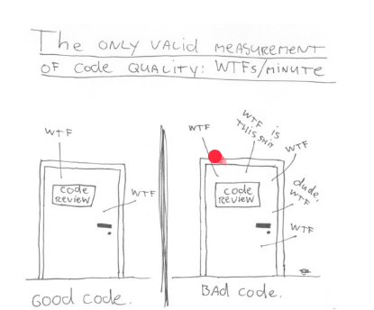

# Clean Code :rocket:

## Apa itu Clean Code?

> Clean code adalah praktik menulis kode yang mudah dipahami, mudah dipelihara, dan mudah dikembangkan. Tujuannya adalah membuat kode lebih bersih dan lebih mudah untuk dipahami oleh orang lain.


Gambar tersebut menyindir gagasan bahwa kualitas kode dapat diukur dengan jumlah "WTF" yang dihasilkan per menit. "WTF" dalam konteks ini mengacu pada saat seorang pengembang melihat kode dan berpikir "Apa-apaan ini?". Semakin banyak "WTF" yang dihasilkan kode, semakin buruk kualitasnya.

Gambar tersebut menyoroti pentingnya menulis kode yang bersih dan mudah dibaca. Kode yang bersih lebih mudah dipahami dan dipelihara, yang dapat membantu mencegah bug dan masalah lainnya. Kode yang bersih juga lebih mudah dipelajari oleh pengembang lain, yang dapat memabantu meningkatkan kolaborasi dan produktivitas.

## Kenapa Clean Code?

1. Work Collaboration: Memudahkan kerja sama antar tim dalam pengembangan perangkat lunak.
2. Feature Development: Mempercepat pengembangan fitur baru.
3. Faster Development: Memungkinkan pengembangan lebih cepat karena kode lebih mudah dipahami dan dikelola.

## Karakteristik Clean Code

1. Mudah Dipahami: Kode dapat dengan mudah dimengerti oleh siapa pun yang membacanya.
2. Mudah Dieja dan Dicari: Nama variabel, fungsi, dan kelas harus mudah dieja dan dicari.
3. Singkat Namun Mendeskripsikan Konteks: Nama variabel, fungsi, dan kelas harus singkat tetapi dapat menjelaskan dengan jelas apa yang dilakukannya.
4. Konsisten: Gaya penulisan kode harus konsisten di seluruh proyek.
5. Hindari Penambahan Konteks yang Tidak Perlu: Hindari menambahkan konteks yang tidak perlu dalam nama variabel, fungsi, dan kelas.
6. Komentar yang Baik: Gunakan komentar dengan bijak untuk menjelaskan kode yang kompleks atau tidak jelas.
7. Good Function: Fungsi harus singkat, melakukan satu hal, dan melakukan dengan baik.
8. Gunakan Konvensi: Gunakan konvensi penamaan dan formatting yang konsisten seperti airbnb javascript style guide dan google python style guide.

```
# Clean Code
customer_name = "John Doe"

# Tidak Clean Code
x = "John Doe"

# Clean Code
type User struct {
    ID       int
    Username string
    Email    string
}

# Tidak Clean Code
type user struct {
    id       int
    username string
    email    string
}
```

## Prinsip Clean Code

**KISS (Keep It Simple Stupid):** Kode harus sesederhana mungkin. Hindari kompleksitas yang tidak perlu.

Contoh:

> - Gunakan fungsi kecil dan terfokus untuk menyelesaikan tugas tertentu.
> - Hindari nesting yang berlebihan.
> - Gunakan struktur data yang tepat untuk mewakili data Anda.

```
// Clean Code
func IsPrime(n int) bool {
    if n <= 1 {
        return false
    }
    for i := 2; i*i <= n; i++ {
        if n%i == 0 {
            return false
        }
    }
    return true
}
```

**DRY (Don't Repeat Yourself)**: Hindari mengulangi kode yang sama di beberapa tempat. Gunakan fungsi dan struktur untuk menghindari duplikasi kode.

Contoh:

> - Gunakan fungsi untuk mengekstrak kode yang berulang.
> - Gunakan struktur data untuk menyimpan data terkait.
> - Gunakan loop untuk mengulangi operasi yang sama pada beberapa elemen.

```
// Clean Code
func CalculateCircleArea(radius float64) float64 {
    return math.Pi * radius * radius
}
```

**Refactoring**: Proses menyempurnakan struktur dan desain kode tanpa mengubah perilakunya. Refactoring membantu meningkatkan kualitas kode dan membuatnya lebih mudah dipelihara.

Contoh:

> - Mengubah nama variabel dan fungsi agar lebih jelas.
> - Memisahkan kode yang kompleks menjadi beberapa fungsi yang lebih kecil.
> - Mengubah struktur data untuk meningkatkan kinerja.

```
// Sebelum Refactoring
func IsEven(n int) bool {
    if n%2 == 0 {
        return true
    }
    return false
}

// Setelah Refactoring
func IsEven(n int) bool {
    return n%2 == 0
}

```

# Thank You :star2:
