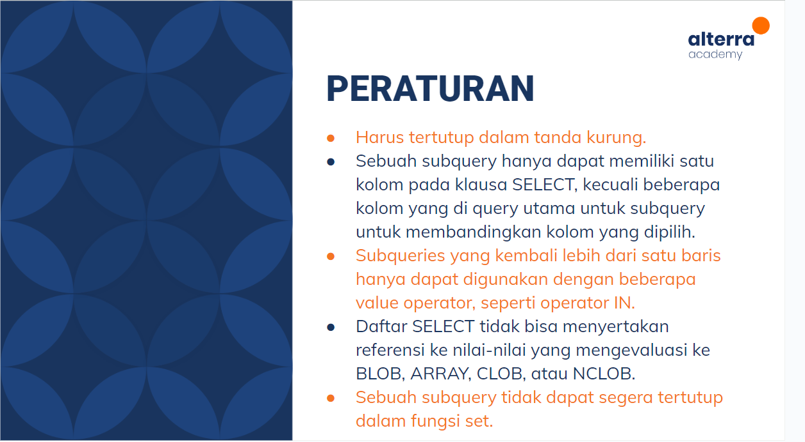

# Join – Union – Agregasi – Subquery – Function (DBMS) :rocket:

Dalam database, seringkali kita perlu menggabungkan data dari dua atau lebih tabel untuk mendapatkan informasi yang lebih lengkap. Hal ini dapat dilakukan dengan menggunakan operasi Join, Union, serta melakukan agregasi data menggunakan fungsi-fungsi tertentu. Selain itu, kita juga dapat menggunakan subquery untuk menghasilkan data yang diperlukan.

## Join

> Join adalah operasi yang digunakan untuk menggabungkan baris dari dua atau lebih tabel berdasarkan kunci relasinya. Terdapat beberapa jenis Join, di antaranya:

### Inner Join

Inner join menggabungkan data dari dua tabel berdasarkan kolom yang sama, dan hanya menampilkan baris yang memiliki nilai yang sama di kedua tabel.

```
SELECT orders.order_id, customers.customer_name
FROM orders
INNER JOIN customers ON orders.customer_id = customers.customer_id;
```

### Left Join

Left join Mmenggabungkan data dari dua tabel berdasarkan kolom yang sama, dan menampilkan semua baris dari tabel kiri, meskipun tidak ada nilai yang sama di tabel kanan.

```
SELECT orders.order_id, customers.customer_name
FROM orders
LEFT JOIN customers ON orders.customer_id = customers.customer_id;
```

### Right Join

Right join menggabungkan data dari dua tabel berdasarkan kolom yang sama, dan menampilkan semua baris dari tabel kanan, meskipun tidak ada nilai yang sama di tabel kiri.

```
SELECT orders.order_id, customers.customer_name
FROM orders
RIGHT JOIN customers ON orders.customer_id = customers.customer_id;
```

## Union

> Union digunakan untuk menggabungkan dua tabel atau lebih dengan struktur yang sama, dan menampilkan semua baris dari kedua tabel.

```
SELECT city FROM customers
UNION
SELECT city FROM suppliers;
```

## Agregasi

> Agregasi digunakan untuk menghitung nilai statistik pada satu atau lebih kolom. Fungsi agregasi yang umum digunakan meliputi:

### Min

Digunakan untuk mengembalikan nilai minimum dalam sebuah kolom. Contohnya:

```
SELECT MIN(salary) AS "Lowest Salary" FROM employees;
```

### Max

Digunakan untuk mengembalikan nilai maksimum dalam sebuah kolom. Contohnya:

```
SELECT MAX(salary) AS "Highest Salary" FROM employees;
```

### Sum

Digunakan untuk mengembalikan total jumlah dalam sebuah kolom. Contohnya:

```
SELECT SUM(salary) AS "Total Salary" FROM employees;
```

### Avg

Digunakan untuk mengembalikan rata-rata nilai dalam sebuah kolom. Contohnya:

```
SELECT AVG(salary) AS "Average Salary" FROM employees;
```

### Count

Digunakan untuk mengembalikan jumlah baris dalam sebuah tabel. Contohnya:

```
SELECT COUNT(*) AS "Total Employees" FROM employees;
```

### Having

Digunakan bersamaan dengan GROUP BY untuk mengatur kondisi pada hasil agregasi. Contohnya:

```
SELECT department, AVG(salary) AS "Average Salary"
FROM employees
GROUP BY department
HAVING AVG(salary) > 50000;
```

## Subquery

> Subquery adalah sebuah query yang dijalankan di dalam query lain. Subquery dapat digunakan untuk menyaring data, melakukan perhitungan, dan menggabungkan data dari beberapa tabel.



```
SELECT customer_id, order_date, amount
FROM orders
WHERE amount > (SELECT AVG(amount) FROM orders);
```

## Function

> Function adalah sekumpulan statement yang akan mengembalikan sebuah nilai balik pada pemanggilnya.

Dibawah ini merupakan function untuk mengembalikan jumlah data dari tweets per user

```
DELIMITER $$

CREATE FUNCTION sf_count_tweet_peruser
(user_id_p int) RETURNS INT DETERMINISTIC

BEGIN

  DECLARE total INT

  SELECT COUNT(*) INTO total FROM tweets

  WHERE user_id = user_id_p AND

  type='tweets';

RETURN total;
END$$

DELIMITER;
```

## Trigger

Trigger adalah blok kode yang dieksekusi secara otomatis ketika suatu peristiwa tertentu terjadi pada tabel, seperti INSERT, UPDATE, atau DELETE. Contohnya:

```
CREATE TRIGGER update_gaji
AFTER UPDATE ON `tabel_karyawan`
FOR EACH ROW
BEGIN
    UPDATE `tabel_karyawan`
    SET gaji = gaji * 1.1
    WHERE id_karyawan = NEW.id_karyawan;
END;
```

# Thank You :star2:
