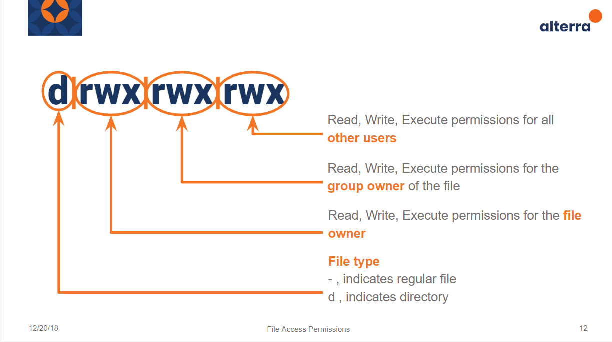
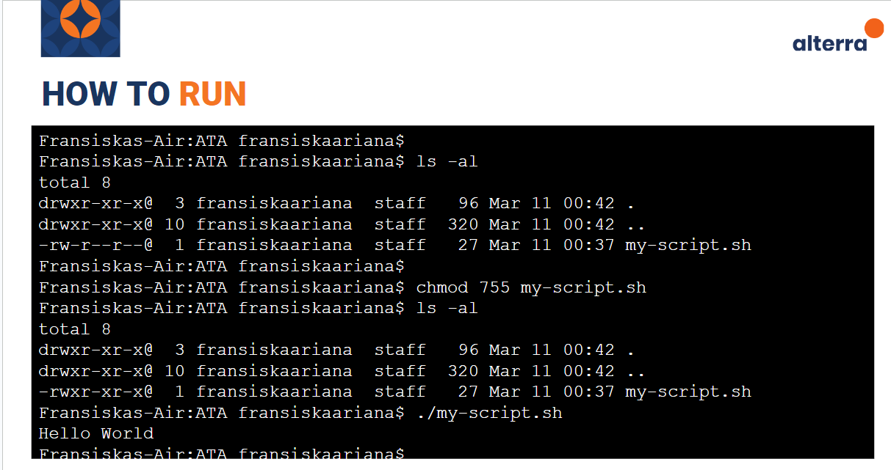
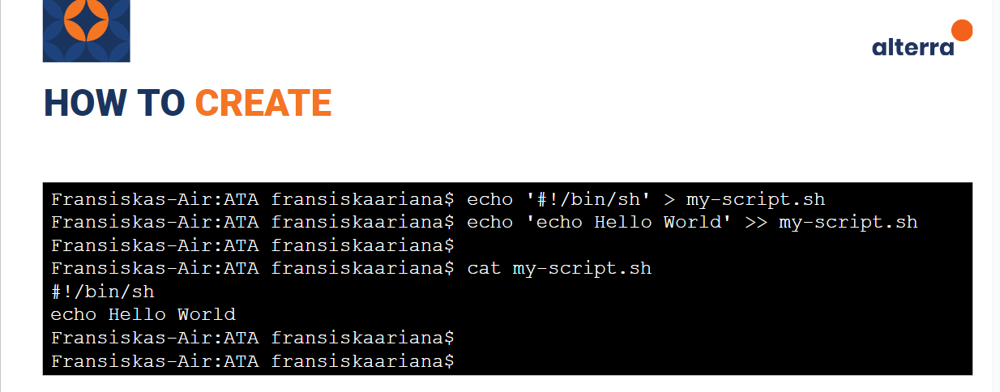

# Configuration Management and Command Line Interface (CLI) :rocket:

Command line adalah antarmuka teks yang memungkinkan pengguna untuk berinteraksi dengan sistem operasi atau aplikasi melalui perintah-perintah teks. Pengguna dapat memberikan instruksi kepada sistem dengan mengetikkan perintah-perintah yang sesuai, dan sistem akan menanggapi perintah tersebut.

## Mengapa menggunakan Command Line

> penting untuk memahami bahwa command line merupakan salah satu cara yang efektif untuk berinteraksi dengan sistem operasi atau aplikasi. Meskipun mungkin terasa tidak familiar atau menakutkan pada awalnya, menggunakan command line dapat memberikan kontrol yang lebih detail dan efisien dalam mengelola sistem dan menjalankan perintah-perintah tertentu.

### 1. Granular Control of an OS or Application

Dengan menggunakan command line, pengguna dapat memiliki kontrol yang lebih detail terhadap sistem operasi atau aplikasi. Ini memungkinkan pengguna untuk melakukan tindakan yang mungkin tidak bisa dilakukan melalui antarmuka grafis.

### 2. Faster Management of a Large Number of Operating Systems

Untuk manajemen sistem operasi yang besar, penggunaan command line dapat lebih efisien daripada antarmuka grafis. Pengguna dapat mengeksekusi perintah-perintah secara massal atau otomatisasi dengan menggunakan skrip.

### 3. Ability to Store Scripts to Automate Regular Tasks

Command line memungkinkan pengguna untuk membuat dan menyimpan skrip-skrip (script) yang dapat digunakan untuk mengotomatisasi tugas-tugas yang dilakukan secara berkala. Hal ini dapat menghemat waktu dan tenaga pengguna.

## Unix Shell

> Unix Shell adalah sebuah program yang menafsirkan perintah-perintah yang diketikkan pengguna di CLI. Ada beberapa jenis Unix Shell, seperti Bash, Zsh, dan Csh.

### Normal User

Sebagai pengguna normal, Anda memiliki akses terbatas terhadap sistem. Anda dapat menjalankan perintah-perintah umum namun tidak dapat melakukan perubahan yang mempengaruhi sistem secara global.

### Root User

Root user memiliki akses penuh ke sistem dan dapat melakukan perubahan yang signifikan. Penggunaan akun root harus dilakukan dengan hati-hati untuk menghindari kerusakan sistem.

### Normal User + Sudoers

Pengguna normal yang ditambahkan ke grup sudoers memiliki hak akses tambahan untuk menjalankan perintah-perintah dengan hak akses root melalui sudo.

## UNIX Shell Most Popular Commands

Ada banyak sekali perintal UNIX Shell yang paling populer diantaranya untuk pengelolaan direktori, file, jaringan, dan utilitas.
dibawah ini adalah contohnya:

### Directory

- pwd: Menampilkan direktori kerja saat ini.
- ls: Menampilkan isi dari sebuah direktori.
- mkdir: Membuat direktori baru.
- cd: Berpindah ke direktori lain.
- rm: Menghapus file atau direktori.
- cp: Menyalin file atau direktori.
- mv: Memindahkan atau mengubah nama file atau direktori.
- ln: Membuat link antara file atau direktori.

### Files

- touch: Membuat file kosong.
- head: Menampilkan baris-baris awal dari sebuah file.
- cat: Menggabungkan dan menampilkan isi dari sebuah file.
- vim or nano: Mengedit file teks.
- chown: Mengubah kepemilikan file atau direktori.
- chmod: Mengubah hak akses file atau direktori.
- diff: Membandingkan isi dua file.

### Network

- ping: Memeriksa koneksi jaringan.
- ssh: Mengakses mesin jarak jauh secara aman.
- netstat: Menampilkan informasi jaringan dan koneksi.
- nmap: Memindai jaringan untuk menemukan host dan layanan.
- ip addr: Menampilkan dan mengonfigurasi alamat IP.
- wget or curl: Mengunduh file dari internet.

### Utility

- man: Menampilkan manual untuk perintah tertentu.
- env: Menampilkan atau mengatur variabel lingkungan.
- echo: Menampilkan teks ke layar.
- date: Menampilkan atau mengatur tanggal dan waktu.
- which: Menampilkan lokasi dari sebuah perintah.
- watch: Menampilkan output perintah secara berkala.
- sudo: Menjalankan perintah dengan hak akses root.
- history: Menampilkan riwayat perintah yang telah dieksekusi.
- grep: Mencari teks dalam file atau output perintah.
- locate: Mencari file dalam sistem.

## Permissions

Dalam Unix/Linux, permissions untuk sebuah file atau direktori direpresentasikan dalam bentuk notasi drwxrwxrwx. Huruf pertama menunjukkan tipe file (d untuk direktori, - untuk file biasa), dan tiga grup berikutnya masing-masing mewakili permissions untuk pemilik (user), grup, dan others.

- -: File biasa.
- d: Direktori.
- l: Tautan simbolik.
- r: Read (membaca).
- w: Write (menulis).
- x: Execute (menjalankan atau mengakses).

## Shell Script

Shell script adalah file teks yang berisi serangkaian perintah yang dapat dieksekusi oleh shell. Untuk membuat shell script, Anda cukup membuat file teks dan menuliskan perintah-perintah di dalamnya. Pastikan file tersebut memiliki permissions untuk dieksekusi.

Untuk menjalankan shell script, Anda perlu memberikan permissions eksekusi ke file tersebut. Kemudian, Anda dapat menjalankannya dengan mengetikkan ./nama_script.sh di command line.

Ini adalah pengantar singkat tentang Configuration Management dan Command Line Interface. Dengan memahami konsep-konsep ini, Anda dapat lebih efektif dalam mengelola sistem dan menjalankan perintah-perintah secara efisien melalui command line.

# Thank You :star2:
