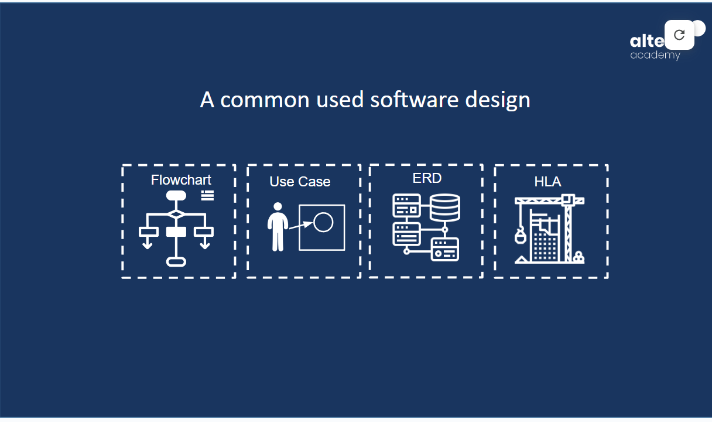
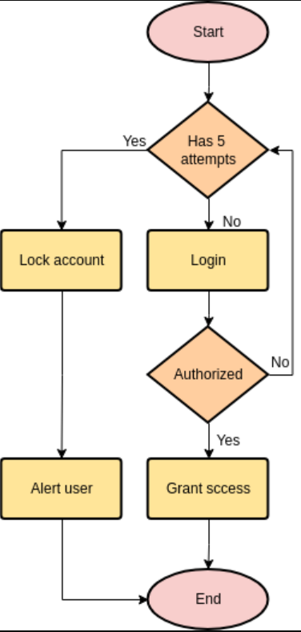
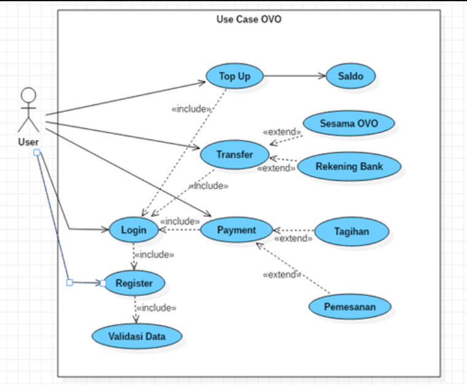
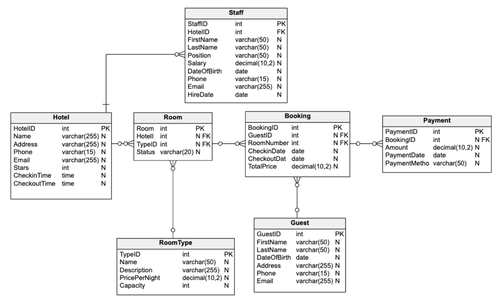
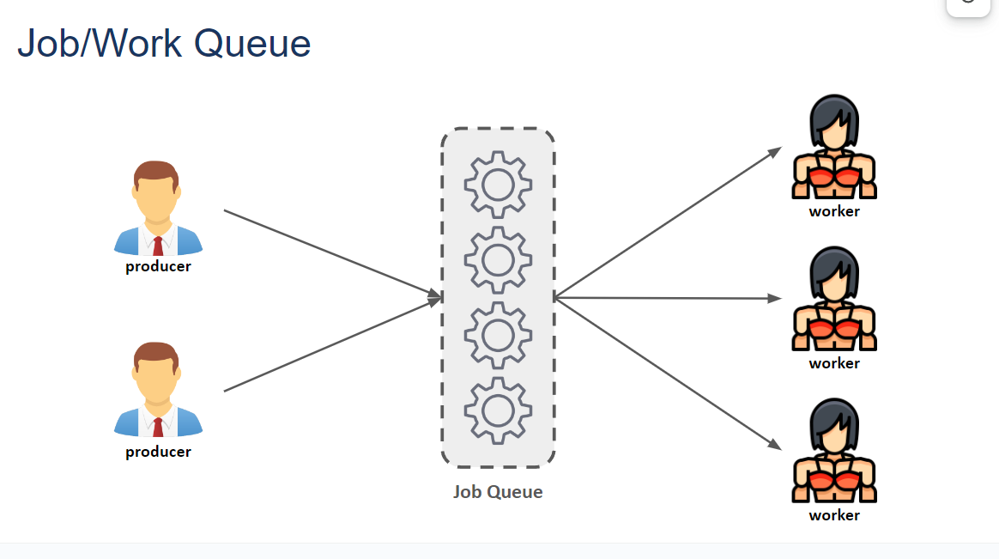

# System Design :rocket:

System design adalah proses merencanakan struktur dan komponen dari sebuah sistem untuk memenuhi kebutuhan bisnis atau teknis tertentu. Hal ini melibatkan pemikiran mendalam tentang bagaimana berbagai bagian dari sistem akan berinteraksi satu sama lain, bagaimana data akan mengalir melalui sistem, dan bagaimana sistem akan berperilaku dalam berbagai situasi.

## Diagram

> Dikutip dari wikipedia, Diagram adalah representasi simbolis dari informasi dengan menggunakan teknik visualisasi.

Diagram juga merupakan representasi visual dari informasi atau data, yang menggunakan simbol-simbol, grafik, dan teks untuk menggambarkan hubungan antara elemen-elemen tersebut. Diagram digunakan untuk memvisualisasikan informasi secara lebih jelas dan mudah dipahami, serta membantu dalam analisis, perencanaan, dan komunikasi konsep atau ide.

Diatas ini merupakan tools/alat yang biasa digunakan untuk membuat sebuah diagram diantaranya adalah [smartdraw](https://www.smartdraw.com), [Lucidchart](https://www.lucidchart.com), [Whimsical](https://www.whimsical.com), [draw.io](https://www.drawio.com), [Visio](https://www.microsoft.com/id-id/microsoft-365/visio/flowchart-software).

**1. Flowchart:**

- Flowchart adalah representasi grafis dari algoritma atau proses.
  Digunakan untuk menggambarkan langkah-langkah dalam suatu proses secara visual.
- Memiliki simbol-simbol standar untuk merepresentasikan langkah-langkah, keputusan, proses, dan arah alur.

Dibawah ini merupakan contoh flowchart proses login.

  

**2. Use Case Diagram:**

- Use case diagram adalah diagram yang mendeskripsikan interaksi antara sistem (perangkat lunak) dengan pemakai atau aktor.

- Menggambarkan fungsionalitas sistem dari sudut pandang pengguna.
- Terdiri dari aktor (pengguna) dan use case (fungsi atau fitur sistem).

Dibawah ini adalah contoh usecase OVO

  

**3. Entity-Relationship Diagram (ERD):**

- ERD adalah diagram yang digunakan untuk memodelkan hubungan antara entitas dalam basis data.
- Memperlihatkan entitas (objek atau konsep dalam dunia nyata) dan hubungan antara entitas tersebut.
- Biasanya terdiri dari entitas, atribut, hubungan, dan kardinalitas.

Dibawah ini adalah contoh ERD Sistem Hotel

  

**4. HLA (High Level Architecture):**

- HLA adalah standar yang digunakan dalam simulasi komputer untuk memungkinkan interaksi antara berbagai model simulasi yang berbeda.
- Memungkinkan integrasi dan interoperabilitas antara model simulasi yang dikembangkan secara independen.
- Digunakan dalam aplikasi seperti simulasi militer, industri, dan keamanan.

Dibawah ini merupakan High Level Architecture

  

## Horizontal Scalling vs Vertical Scalling

Kapan pun kita merancang sistem yang besar, kita perlu mempertimbangkan beberapa hal:

1. Apa saja bagian arsitektur yang berbeda yang dapat digunakan?
2. Bagaimana bagian-bagian ini bekerja satu sama lain?
3. Bagaimana cara terbaik untuk memanfaatkan bagian-bagian ini: apa saja pengorbanan yang tepat?

Membiasakan diri dengan konsep-konsep ini akan sangat bermanfaat dalam memahami konsep sistem terdistribusi.

## Distributed Systems

Sistem terdistribusi adalah sistem komputer di mana komponen-komponennya, yang terletak pada komputer yang berbeda dalam jaringan komputer, berkomunikasi dan berkoordinasi melalui pesan. Beberapa karakteristik utama dari sistem terdistribusi adalah:

### Skalabilitas

Skalabilitas adalah kemampuan sistem, proses, atau jaringan untuk tumbuh dan mengelola permintaan yang meningkat. Sistem terdistribusi apa pun yang dapat terus berkembang untuk mendukung jumlah pekerjaan yang terus bertambah dianggap dapat diskalakan.
Sebuah sistem mungkin harus diskalakan karena berbagai alasan seperti peningkatan volume data atau peningkatan jumlah pekerjaan, misalnya jumlah transaksi. Sistem yang dapat diskalakan ingin mencapai penskalaan ini tanpa kehilangan kinerja.

### Realibility

Secara definisi, Realibity/keandalan adalah probabilitas suatu sistem akan gagal dalam periode tertentu. Secara sederhana, sistem terdistribusi dianggap dapat diandalkan jika sistem tersebut tetap memberikan layanannya bahkan ketika satu atau beberapa komponen perangkat lunak atau perangkat kerasnya gagal. Keandalan merupakan salah satu karakteristik utama dari sistem terdistribusi, karena dalam sistem seperti itu, mesin yang gagal selalu dapat digantikan oleh mesin lain yang sehat, memastikan penyelesaian tugas yang diminta.

### Availability

Menurut definisi, Availability/ketersediaan adalah waktu sebuah sistem tetap beroperasi untuk menjalankan fungsi yang diperlukan dalam periode tertentu. Ini adalah ukuran sederhana dari persentase waktu sistem, layanan, atau mesin tetap beroperasi dalam kondisi normal.
Contoh: pesawat yang dapat diterbangkan selama berjam-jam dalam sebulan tanpa banyak waktu henti dapat dikatakan memiliki ketersediaan yang tinggi.

### Eficiency

Untuk memahami cara mengukur efisiensi sistem terdistribusi, mari kita asumsikan kita memiliki sebuah operasi yang berjalan secara terdistribusi dan mengirimkan sekumpulan item sebagai hasilnya. Dua ukuran standar efisiensi adalah waktu respons (atau latensi) yang menunjukkan penundaan untuk mendapatkan item pertama dan throughput (atau bandwidth) yang menunjukkan jumlah item yang dikirimkan dalam satuan waktu tertentu (misalnya, satu detik).

### Serviceability or manageability

Kemudahan servis atau pengelolaan adalah kemudahan dan kecepatan sebuah sistem untuk diperbaiki atau dipelihara; jika waktu untuk memperbaiki sistem yang gagal meningkat, maka ketersediaan akan menurun. Hal-hal yang perlu dipertimbangkan untuk pengelolaan adalah kemudahan mendiagnosis dan memahami masalah saat terjadi, kemudahan melakukan pembaruan atau modifikasi, dan seberapa sederhana sistem tersebut beroperasi (yaitu, apakah sistem tersebut secara rutin beroperasi tanpa kegagalan atau pengecualian?)

## Job/Work Queue

"Dalam perangkat lunak sistem, antrean pekerjaan (terkadang antrean batch), adalah struktur data yang dikelola oleh perangkat lunak penjadwal pekerjaan yang berisi pekerjaan yang akan dijalankan."
Wikipedia - Job Queue

"Antrian Pekerjaan adalah kerangka kerja untuk membangun aplikasi master-pekerja besar yang menjangkau ribuan mesin yang diambil dari cluster, cloud, dan grid."
CCL University of Notre Dame - Work Queue: A Scalable Master/Worker Framework

## Load Balancing

Load Balancer (LB) adalah komponen penting lainnya dari sistem terdistribusi. LB membantu menyebarkan lalu lintas di seluruh cluster server untuk meningkatkan daya tanggap dan ketersediaan aplikasi, situs web, atau basis data. LB juga melacak status semua sumber daya saat mendistribusikan permintaan. Jika sebuah server tidak tersedia untuk menerima permintaan baru atau tidak merespons atau memiliki tingkat kesalahan yang tinggi, LB akan berhenti mengirim lalu lintas ke server tersebut.

Untuk memanfaatkan skalabilitas dan redundansi penuh, kita dapat mencoba menyeimbangkan beban di setiap lapisan sistem. Kita dapat menambahkan LB di tiga tempat:

1. Antara pengguna dan server web
2. Antara server web dan lapisan platform internal, seperti server aplikasi atau server cache
3. Antara lapisan platform internal dan database.

## Monolithic and Microservices

Aplikasi monolitik memiliki basis kode tunggal dengan beberapa modul. Modul dibagi menjadi dua, yaitu untuk fitur bisnis dan fitur teknis. Memiliki sistem pembangunan tunggal yang membangun seluruh aplikasi dan/atau ketergantungan. Ini juga memiliki biner tunggal yang dapat dieksekusi atau diterapkan.

Microservcies adalah layanan yang dapat digunakan secara independen yang dimodelkan di sekitar domain bisnis. Layanan ini berkomunikasi satu sama lain melalui jaringan, dan sebagai pilihan arsitektur menawarkan banyak pilihan untuk menyelesaikan masalah yang mungkin Anda hadapi. Oleh karena itu, arsitektur layanan mikro didasarkan pada beberapa layanan mikro yang berkolaborasi.

## SQL vs NoSQL

SQL dan NoSQL (atau basis data relasional dan basis data non-relasional).
Basis data relasional terstruktur dan memiliki skema yang sudah ditentukan sebelumnya seperti buku telepon yang menyimpan nomor telepon dan alamat.

Basis data non-relasional tidak terstruktur, dan memiliki skema dinamis seperti folder file yang menyimpan segala sesuatu mulai dari alamat dan nomor telepon seseorang hingga 'suka' Facebook dan preferensi belanja online.

**Atomicity**

- Atomicity; transaksi terjadi semua atau tidak sama sekali
- Consistency; data tertulis merupakan data valid yang ditentukan berdasarkan aturan tertentu
- Isolation; pada saat terjadi request yang bersamaan (concurrent), memastikan bahwa transaksi dieksekusi seperti dijalankan secara sekuensial
- Durability; jaminan bahwa transaksi yang telah tersimpan, tetap tersimpan.

Dalam hal teknologi database, tidak ada satu solusi yang cocok untuk semua. Itulah mengapa banyak bisnis mengandalkan database relasional dan non-relasional untuk kebutuhan yang berbeda. Meskipun database NoSQL semakin populer karena kecepatan dan skalabilitasnya, masih ada situasi di mana database SQL yang sangat terstruktur dapat berkinerja lebih baik; memilih teknologi yang tepat bergantung pada kasus penggunaan.

## Caching

Cache yang digunakan dalam data yang baru saja diminta kemungkinan besar akan diminta lagi. Cache digunakan di hampir semua lapisan komputasi: perangkat keras, sistem operasi, peramban web, aplikasi web, dan banyak lagi.

Cache seperti memori jangka pendek: cache memiliki jumlah ruang yang terbatas, tetapi biasanya lebih cepat daripada sumber data asli dan berisi item yang terakhir diakses. Cache dapat berada di semua tingkat dalam arsitektur, tetapi sering ditemukan di tingkat yang paling dekat dengan front end di mana cache diimplementasikan untuk mengembalikan data dengan cepat tanpa membebani tingkat hilir.

## Database Replication

Redundansi adalah duplikasi komponen atau fungsi penting dari sebuah sistem dengan tujuan untuk meningkatkan keandalan sistem, biasanya dalam bentuk cadangan atau pengaman kegagalan, atau untuk meningkatkan kinerja sistem yang sebenarnya. Sebagai contoh, jika hanya ada satu salinan file yang disimpan di satu server, maka kehilangan server tersebut berarti kehilangan file tersebut. Karena kehilangan data jarang sekali merupakan hal yang baik, kita dapat membuat salinan duplikat atau redundan dari file tersebut untuk mengatasi masalah ini.

## Database Indexing

"Pengindeksan adalah cara untuk mengoptimalkan kinerja database dengan meminimalkan jumlah akses disk yang diperlukan saat kueri diproses. Ini adalah teknik struktur data yang digunakan untuk menemukan dan mengakses data dalam database dengan cepat."
Geeksforgeeks - Indexing Database
Sebagian besar database menggunakan B-Tree sebagai struktur data untuk pengindeksan. Dan B-Tree memiliki kompleksitas O(log n) untuk operasi pencarian, penghapusan dan penyisipan.

Dengan halaman indeks, Anda tahu ke mana harus mencari! Dan lagi, untuk mencari Bab tertentu yang penting, Anda hanya perlu melihat halaman indeks, lagi dan lagi, setiap saat. Setelah menemukan indeks yang sesuai, Anda dapat langsung melompat ke bab tersebut secara efisien dengan melewatkan bab lainnya.

Namun, selain 1000 halaman yang sebenarnya, Anda akan membutuhkan ~10 halaman lagi untuk menampilkan indeks, jadi total 1010 halaman.

# Thank You :star2:
