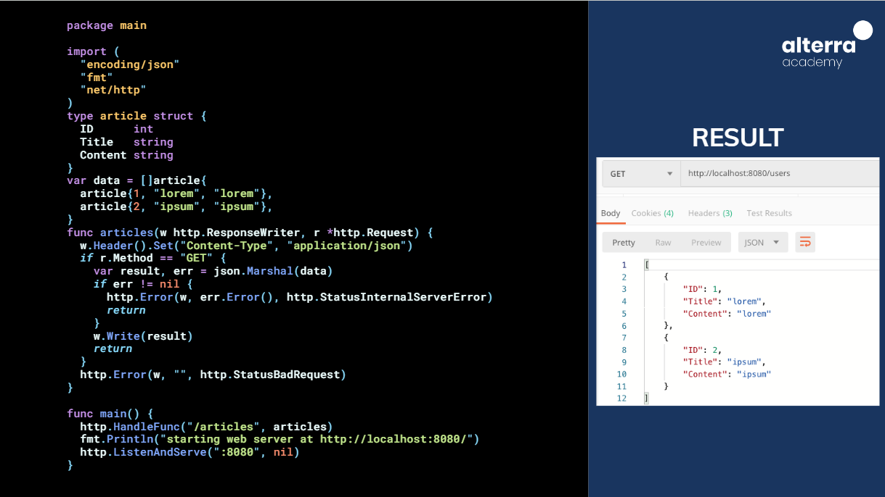

# Intro RESTful API :rocket:

API (Application Programming Interface) adalah antarmuka pemrograman aplikasi yang memungkinkan dua aplikasi atau perangkat lunak untuk berkomunikasi dan bertukar data. API bertindak sebagai perantara, memungkinkan aplikasi untuk mengakses data dan fungsionalitas dari aplikasi lain tanpa perlu mengetahui detail implementasinya.

## Ilustrasi API

Bayangkan Anda ingin memesan makanan dari restoran. Anda dapat:

- elepon restoran: Anda berbicara langsung dengan staf restoran dan memesan makanan. Ini seperti API langsung, di mana Anda berkomunikasi langsung dengan aplikasi lain.
- Aplikasi pemesanan online: Anda menggunakan aplikasi untuk memesan makanan. Aplikasi ini berkomunikasi dengan API restoran untuk memesan makanan atas nama Anda. Ini seperti API termediasi, di mana aplikasi pihak ketiga bertindak sebagai perantara.

## Bagaimana API bekerja

API bekerja dengan cara berikut:

1. Klien (aplikasi yang ingin mengakses data) membuat permintaan ke server API.
2. Server API memproses permintaan dan mengembalikan respons.
3. Klien menerima respons dan memproses datanya.

## REST API

REST API (Representational State Transfer API) adalah jenis API yang mengikuti seperangkat aturan yang membuatnya mudah digunakan dan dipahami. REST API menggunakan metode HTTP standar (GET, POST, PUT, DELETE) untuk mengakses data.

**Karakteristik REST API:**

- Sumber daya: Data yang diakses melalui REST API disebut sumber daya. Setiap sumber daya memiliki alamat URL yang unik.
- Metode HTTP: REST API menggunakan metode HTTP standar (GET, POST, PUT, DELETE) untuk mengoperasikan sumber daya.
  Format data: REST API biasanya menggunakan format data JSON atau XML untuk menukar data.

**Keuntungan REST API:**

- Mudah digunakan: REST API mudah dipahami dan digunakan oleh pengembang.
- Skalabilitas: REST API dapat dengan mudah diskalakan untuk mendukung banyak pengguna dan aplikasi.
- Ketersediaan: REST API tersedia di berbagai platform dan bahasa pemrograman.

## JSON

JSON (JavaScript Object Notation) adalah format data yang ringan dan mudah dibaca manusia yang sering digunakan dalam API untuk menukar data. JSON terdiri dari pasangan kunci-nilai dan array

Contoh JSON:

```
{
  "nama": "John Doe",
  "umur": 30,
  "alamat": "Jl. Merdeka 12"
}
```

## HTTP Method

REST API menggunakan metode HTTP standar untuk mengoperasikan sumber daya. Berikut adalah beberapa metode HTTP yang umum digunakan:

- GET: Mengambil data dari server.
- POST: Menambahkan data ke server.
- PUT: Memperbarui data di server.
- DELETE: Menghapus data dari server.

## HTTP Status Code

Server API mengembalikan kode status HTTP untuk menunjukkan status permintaan. Berikut adalah beberapa kode status HTTP yang umum digunakan:

- 200 OK: Permintaan berhasil.
- 400 Bad Request: Permintaan tidak valid.
- 401 Unauthorized: Akses tidak diizinkan.
- 404 Not Found: Data yang diminta tidak ditemukan.
- 500 Internal Server Error: Terjadi kesalahan pada server.

## API Tools

Ada banyak alat yang tersedia untuk membantu Anda membangun dan menggunakan API. Berikut adalah beberapa alat API yang populer:

- Postman: Alat untuk menguji dan debug API.
- Swagger: Alat untuk mendokumentasikan API.
- curl: Alat baris perintah untuk membuat permintaan HTTP.

## Versioning

Versioning adalah praktik memberikan versi berbeda dari API Anda. Ini memungkinkan Anda untuk membuat perubahan pada API Anda tanpa merusak aplikasi yang menggunakannya.

```
https://us6.api.mailchimp.com/3.0/(major + minor version indication)

https://us6.api.mailchimp.com/v1/(major version indication)

```

## Package net/http

Package net/http adalah package Go yang menyediakan API untuk membangun server HTTP dan klien. Package ini dapat digunakan untuk membangun REST API Anda sendiri.


# Thank You :star2:
