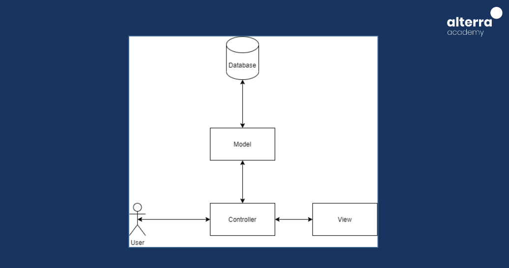

# Intro Echo Golang :rocket:

## Apa itu Object Relational Mapping(ORM)

Object-Relational Mapping (ORM) adalah sebuah teknik pemrograman yang memungkinkan pengembang untuk bekerja dengan basis data relasional menggunakan paradigma berorientasi objek. Dalam ORM, framework akan menyediakan cara untuk menghubungkan antara struktur data dalam basis data dengan struktur objek dalam kode program. Dengan kata lain, ORM mengizinkan pengembang untuk memanipulasi data dalam basis data menggunakan objek-objek dalam kode program, sehingga memudahkan proses akses dan manipulasi data. Ini memungkinkan pengembang untuk fokus pada logika bisnis aplikasi tanpa perlu terlalu memikirkan detail-detail koneksi dan manipulasi data di dalam basis data.

### Keuntungan ORM:

- Productivity: ORM memungkinkan pengembang untuk fokus pada logika bisnis aplikasi daripada menulis query SQL kompleks, sehingga meningkatkan produktivitas.

- Portability: ORM memungkinkan aplikasi untuk mudah beralih dari satu sistem manajemen basis data (SMBD) ke SMBD lainnya tanpa perlu mengubah banyak kode.

- Abstraksi Database: ORM menyediakan abstraksi antara basis data relasional dan kode aplikasi, sehingga pengembang tidak perlu memahami detail teknis dari setiap SMBD.

- Kemudahan Pengembangan: Dengan ORM, pengembang dapat dengan mudah membuat dan mengelola entitas database menggunakan objek dalam kode aplikasi, tanpa perlu menulis query SQL manual.

- Keamanan: ORM sering kali menyertakan fitur validasi data yang membantu mencegah serangan SQL injection dan kesalahan validasi data lainnya.

### Kekurangan ORM:

- Kinerja: Dalam beberapa kasus, penggunaan ORM dapat mengakibatkan kinerja aplikasi yang kurang efisien dibandingkan dengan menulis query SQL langsung, terutama pada operasi-operasi yang kompleks.

- Kompleksitas: Penggunaan ORM dapat meningkatkan kompleksitas kode aplikasi karena pengembang perlu memahami konsep-konsep ORM tertentu dan cara kerjanya.

- Optimalisasi Kustomisasi: Dalam beberapa kasus, ORM mungkin tidak memberikan fleksibilitas optimal untuk mengoptimalkan query atau skema basis data sesuai kebutuhan aplikasi.

- Overhead Memori dan Penggunaan Sumber Daya: ORM dapat menggunakan lebih banyak memori dan sumber daya CPU dibandingkan dengan menulis query SQL langsung karena adanya lapisan abstraksi tambahan.

- Keterbatasan Fitur: Beberapa fitur kompleks dari SMBD mungkin tidak didukung secara penuh oleh ORM, sehingga memerlukan penulisan query SQL langsung untuk menggunakan fitur tersebut.

## Apa itu GORM

GORM adalah singkatan dari "Go Object Relational Mapping", sebuah library ORM yang populer digunakan dalam bahasa pemrograman Go. GORM memungkinkan pengembang Go untuk berinteraksi dengan basis data relasional seperti MySQL, PostgreSQL, dan SQLite menggunakan pendekatan berorientasi objek. Dengan GORM, pengembang dapat dengan mudah membuat, membaca, memperbarui, dan menghapus data dalam basis data tanpa perlu menulis SQL secara langsung. GORM juga menyediakan fitur-fitur seperti pembuatan skema otomatis, validasi data, dan hubungan antar entitas, yang mempermudah pengembangan aplikasi berbasis database menggunakan Go.

## Instalasi GORM

Untuk menginstal GORM, Anda dapat menggunakan Go modules untuk mengelola dependensi proyek Anda. Berikut adalah langkah-langkah umum untuk menginstal GORM:

1. Pastikan Anda telah mengatur Go environment di komputer Anda. Anda dapat mengikuti petunjuk di https://golang.org/doc/install untuk menginstal Go.

2. Buat sebuah proyek Go baru atau navigasikan ke dalam proyek yang sudah ada.

3. Buka terminal atau command prompt, lalu ketik perintah berikut untuk menginstal GORM dan driver basis data yang ingin Anda gunakan (contoh: MySQL):

```
go get -u gorm.io/gorm
go get -u gorm.io/driver/mysql
```

## Koneksi ke GORM

Setelah dependensi terinstal, Anda dapat mengimpor GORM dan driver basis data yang Anda gunakan ke dalam proyek Anda dengan cara menambahkan import statement di file Go Anda:

```
import (
    "gorm.io/gorm"
    "gorm.io/driver/mysql"
)
```

Selanjutnya, Anda perlu mengonfigurasi koneksi basis data dalam proyek Anda. Berikut adalah contoh konfigurasi untuk MySQL:

```
// DSN (Data Source Name) format untuk koneksi MySQL
dsn := "user:password@tcp(localhost:3306)/dbname?charset=utf8mb4&parseTime=True&loc=Local"

// Membuat koneksi basis data MySQL
db, err := gorm.Open(mysql.Open(dsn), &gorm.Config{})
if err != nil {
    panic("Failed to connect to database!")
}
```

Sekarang, Anda dapat menggunakan GORM untuk berinteraksi dengan basis data Anda. Misalnya, untuk membuat tabel baru dalam basis data:

```
// Membuat tabel baru dalam basis data
db.AutoMigrate(&YourModel{})
```

## Code Structure Model-View-Controller(MVC)


Konsep MVC (Model-View-Controller) pada Golang dengan GORM (Go Object Relational Mapping) mirip dengan konsep MVC pada umumnya, namun dengan implementasi yang disesuaikan dengan paradigma pemrograman Go. Berikut adalah penjelasan singkat tentang konsep MVC dalam konteks Golang dengan GORM:

**1. Model**
Model adalah representasi dari struktur data dalam basis data. Dalam Golang dengan GORM, Model direpresentasikan oleh sebuah struct yang menggambarkan tabel dalam basis data.

```
type User struct {
    ID       uint   `gorm:"primaryKey"`
    Name     string
    Email    string
    Password string
}
```

**2. View**
View adalah tampilan dari data yang ditampilkan kepada pengguna. Dalam konteks web, View biasanya berupa template HTML yang digenerate oleh server dan ditampilkan kepada pengguna. Dalam Golang, penggunaan View seringkali tidak sekompleks di web framework lain, karena Golang cenderung lebih fokus pada logika aplikasi dan memanfaatkan template engine terpisah jika diperlukan.

**3. Controller**
Controller adalah bagian yang mengatur interaksi antara Model dan View. Dalam Golang dengan GORM, Controller dapat berupa fungsi-fungsi yang mengambil data dari Model menggunakan GORM, dan mengirimkan data tersebut ke View.

```
func GetUserByID(c *gin.Context) {
    var user User
    userID := c.Param("id")
    result := db.First(&user, userID)
    if result.Error != nil {
        c.JSON(http.StatusNotFound, gin.H{"error": "User not found"})
        return
    }
    c.JSON(http.StatusOK, user)
}
```

Dalam implementasi MVC dengan Golang dan GORM, Model digunakan untuk merepresentasikan struktur data dalam basis data, Controller digunakan untuk mengatur logika aplikasi dan interaksi dengan Model, sedangkan View seringkali lebih sederhana atau tidak terlalu diperlukan tergantung pada kebutuhan aplikasi.

# Thank You :star2:
