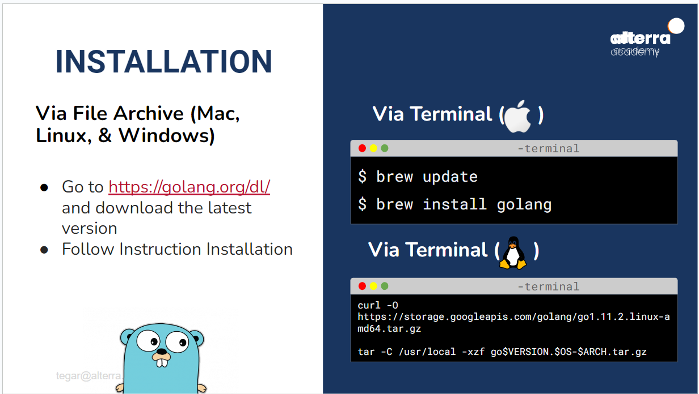
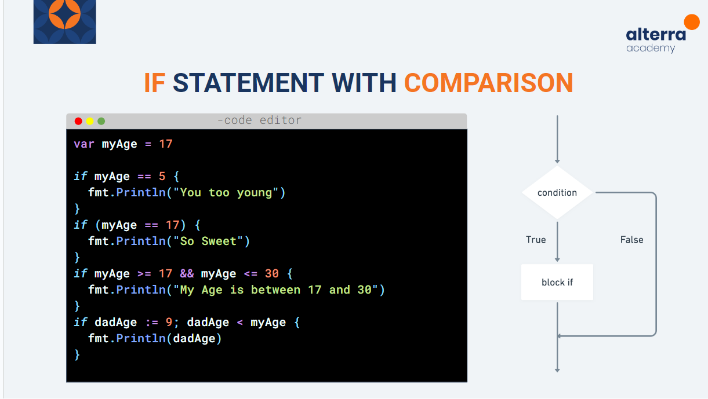
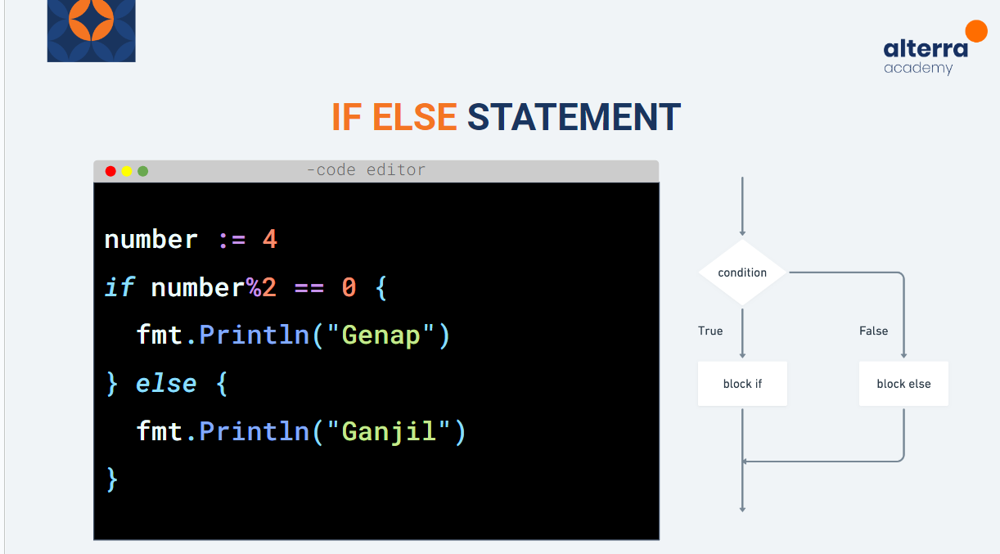
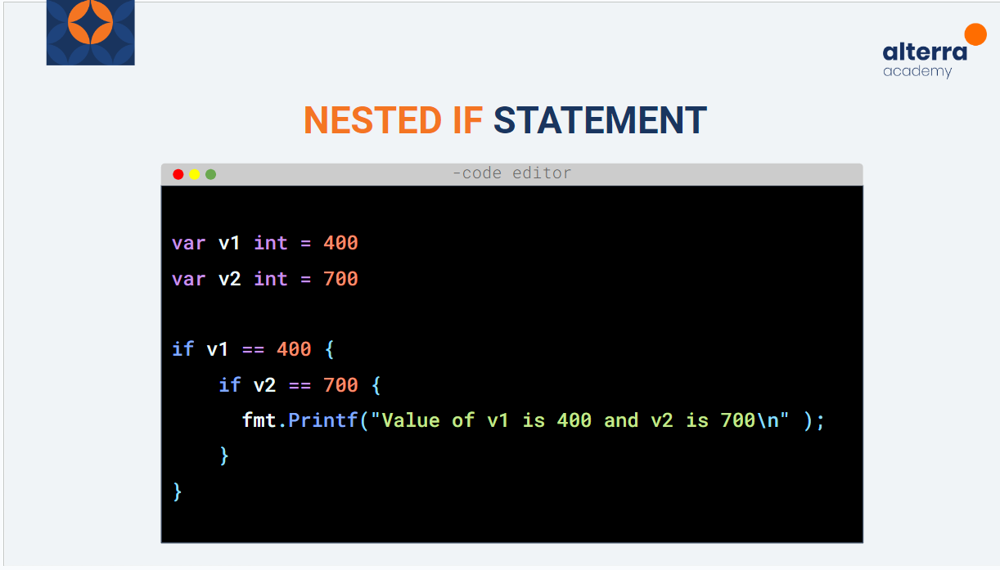
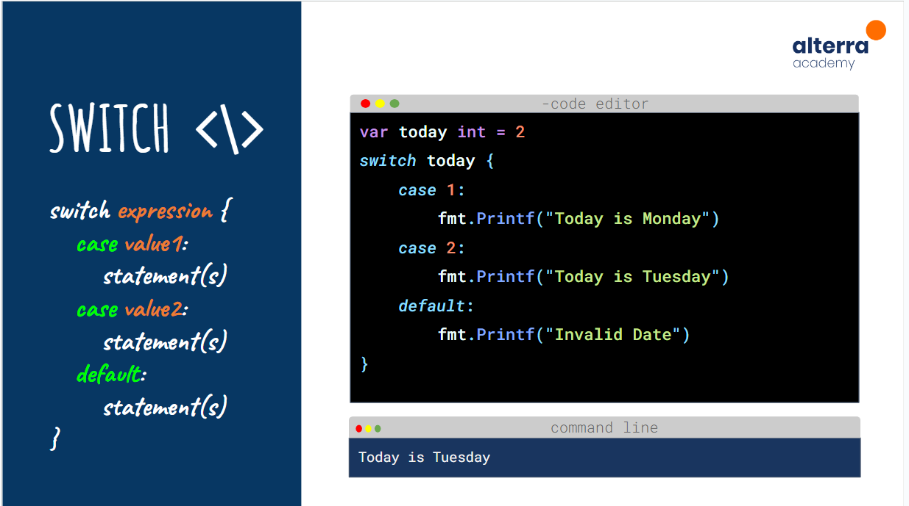
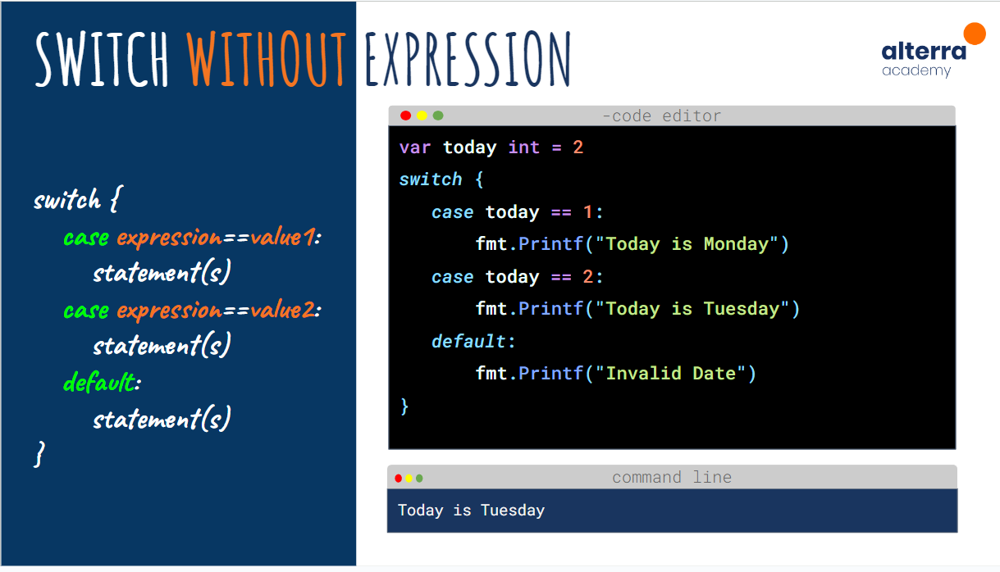
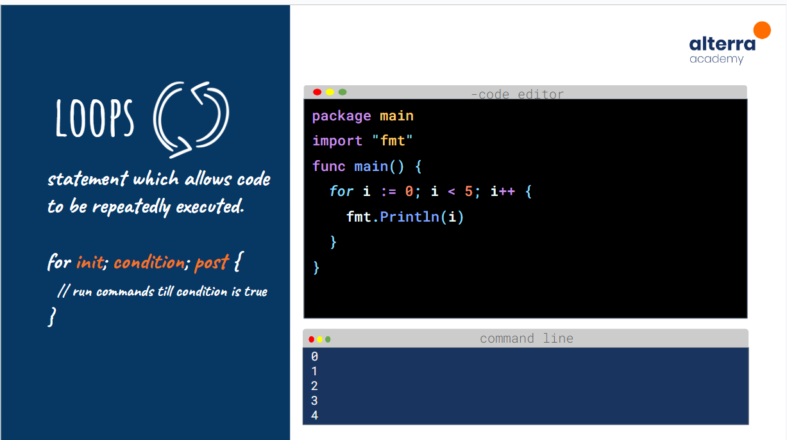
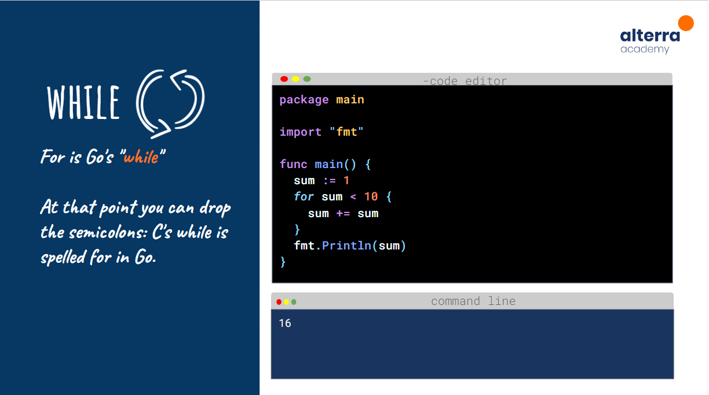
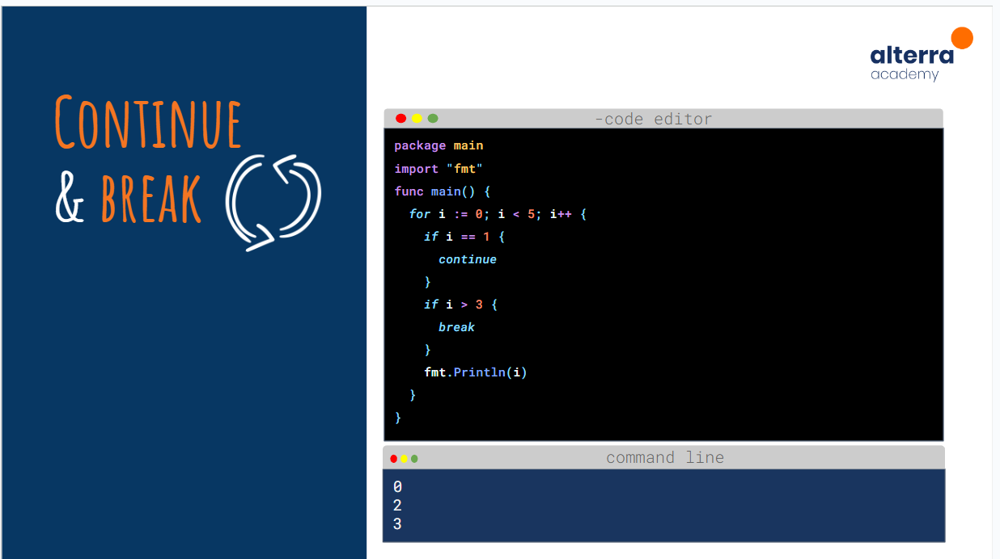
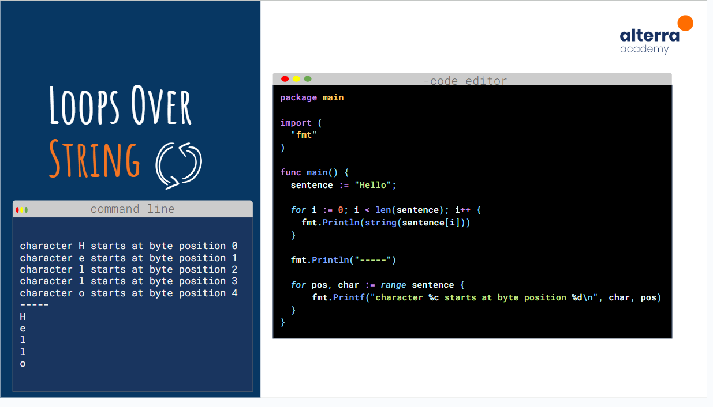

# Basic Programming :rocket:


> Golang adalah bahasa pemrograman open-source yang dikembangkan oleh google, berguna untuk mengembangkan web, layanan cloud dan jaringan, serta jenis perangkat lunak lainnya.
> Pada program aplikasi, golang biasanya digunakan untuk website e-commerce, music player, social media apps, dll.
> Pada sistem program, golang biasanya digunakan untuk pembuatan API, game engine, CLI app, dll.

## Pengembang Golang


Ada beberapa developer yang membuat golang diantaranya :

> 1. Robert Grisemer
> 2. Rob Pike
> 3. ken Thompson
> 4. Ian Lance Taylor
> 5. Russ Cox

## Installasi Golang



Anda bisa menginstall golang di os manapun seperti MAC dan Windows, anda bisa menginstall melalui :

> 1. Via File Archive: https://go.dev/dl/
> 2. Via Terminal: curl -O https://storage.googleapis.> com/golang/go1.11.2.linux-amd64.tar.gz
>    tar -C /usr/local -xzf go$VERSION.$OS-$ARCH.tar.gz

## Go Workspace

> 1. Bin: berisi hasil dari build berbentuk binary file.
> 2. Pkg: berisi arsip paket Go.
> 3. Src: berisi file sumber Go.

## Command Go Terminal

> 1. go run : berfungsi mengeksekusi program dengan ekstensi .go
> 2. go build: berfungsi mengkompilasi file program.
> 3. go install: seperti go build dan melanjutkan proses instalasi.
> 4. go test: berfungsi untuk melakukan testing.
> 5. berfungsi untuk mendownload paket go.

## Variabel

> Variabel digunakan untuk menyimpan informasi dalam program komputer, variabel menyediakan cara untuk melabeli data dengan nama deskriptif dan memiliki tipe data (boolean, numerik, string).

Contoh variabel pada golang :
**Long:**

```
var <nama_variabel> <tipe_data>
var <nama_variabel> <tipe_data> = <nilai>
var <list_nama_variabel> <tipe_data>
var <list_nama_variabel> <tipe_data> = <nilai>
```

**Short:**

```
<nama_variabel> := <nilai>
```

## Zero Values

```
Boolean     -> False
Float       -> 0.0
Integers    -> 0
Strings     -> ""
```

## Control Structures

**Branching**






**Looping**





# Thank You :star2:
