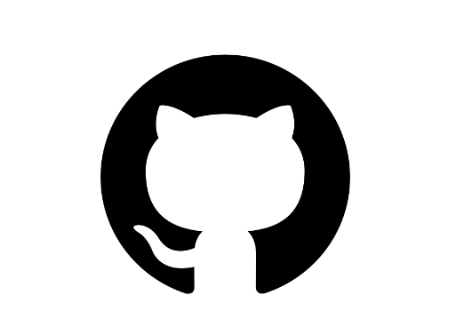

# Version Control and Branch Management (Git) :rocket:

> Sebelum masuk ke git, kita akan berkenanalan tentang versioning.

## Versioning

> Versioning adalah cara untuk mengatur versi dari source code program kita.

### Tools Versioning

> 1. Versioning Control System (VCS)
> 2. Source Code Manager (SCM)
> 3. Revision Control System (RCS)

## Git


> Salah satu Version Control System yang paling umum digunakan oleh pengembang untuk berkolaborasi dalam pengembangan perangkat lunak.
> **Git dapat melacak setiap perubahan file dan Git juga dapat melakukan pembatalan pada beberapa poin kita menyebutnya sebagai Commit.**

## Github



> Menyiapkan server Git cukup rumit, Layanan diperlukan untuk menjadi server.

### Cara installasi git

> 1. Unduh penginstal Git untuk Windows terbaru.
> 2. Setelah Anda berhasil menjalankan penginstal, Anda akan melihat layar wizard Pengaturan Git. Ikuti petunjuk Berikutnya dan Selesai untuk menyelesaikan instalasi. Opsi default cukup masuk akal untuk sebagian besar pengguna.
> 3. Buka Command Prompt (atau Git Bash jika selama instalasi Anda memilih untuk tidak menggunakan Git dari Command Prompt Windows).

## Bekerja dengan Git

### Git Config, Git Init, dan Git Clone

**Git config:** Perintah ini digunakan untuk mengonfigurasi Git pada level global atau proyek. Misalnya, Anda dapat mengatur nama pengguna, alamat email, atau bahkan alias perintah Git.

```
git config --global user.name "Nama Anda"
git config --global user.email "email@anda.com"
```

**Git init:** Perintah ini digunakan untuk membuat repository Git baru atau menginisialisasi repository Git dalam direktori yang sudah ada. Setelah dijalankan, direktori tersebut akan menjadi repository Git, dan Git akan mulai mengawasi perubahan pada file dalam direktori.

```
git init
git remote add <remote_name> <remote_repo_url>
git push -u <remote_name> <local_branch_name>
```

**Git remote**: perintah yang digunakan untuk mengelola remote repository Git. Remote repository adalah repository yang berada di server atau lokasi lain, seperti GitHub, GitLab, atau server Git lainnya. Dengan git remote, Anda dapat menambahkan, menghapus, menampilkan, atau mengubah remote repository yang terhubung dengan repository lokal Anda

```
git remote add <remote_name> <remote_repo_url>
```

**Git clone:** Perintah ini digunakan untuk mengkloning repository Git yang sudah ada dari server ke lokal. Dengan perintah ini, Anda dapat membuat salinan lengkap dari repository tersebut di komputer lokal Anda.

```
git clone https://github.com/nama_pengguna/repository.git
```

### Git Status, Git add, dan Git Commit

**Git status:** perintah yang digunakan dalam Git untuk menampilkan informasi tentang status dari file-file dalam repository Anda. Perintah ini memberikan gambaran tentang file-file mana yang telah diubah, file mana yang sudah ditambahkan ke staging area, dan file-file mana yang belum dilacak oleh Git. Output dari perintah git status biasanya terlihat seperti ini:

```
On branch master
Your branch is up to date with 'origin/master'.

Changes not staged for commit:
  (use "git add <file>..." to update what will be committed)
  (use "git restore <file>..." to discard changes in working directory)
        modified:   file1.txt
        modified:   file2.txt

no changes added to commit (use "git add" and/or "git commit -a")

```

**Git add:** Perintah ini digunakan untuk menambahkan perubahan pada file di working directory ke staging area. Staging area adalah tempat di mana Anda menyiapkan perubahan sebelum melakukan commit. Dengan kata lain, git add menginformasikan Git bahwa Anda ingin menyertakan perubahan tertentu dalam commit berikutnya.

```
git add nama_file
git add .
```

**Git commit:** Perintah ini digunakan untuk menyimpan perubahan yang telah ditambahkan ke staging area ke dalam repository Git secara permanen. Setiap commit memiliki pesan yang menjelaskan perubahan yang dilakukan. Pesan ini penting untuk menjelaskan tujuan atau konteks dari perubahan yang dilakukan.

```
git commit -m "pesan commit"
```

## Working directory dan Staging Area

1. Working Directory: Ini adalah direktori tempat Anda bekerja dengan file-file proyek Anda. Ketika Anda melakukan perubahan pada file-file ini, Git menandai file-file tersebut sebagai "modified".

2. Staging Area (Index): Staging area adalah area di mana Anda menyiapkan perubahan yang ingin Anda sertakan dalam commit berikutnya. Anda menggunakan git add untuk menambahkan perubahan dari working directory ke staging area. File-file yang sudah ditambahkan ke staging area akan ditandai sebagai "staged".

3. Repository: Setelah perubahan sudah ditambahkan ke staging area, Anda dapat melakukan commit dengan git commit untuk menyimpan perubahan tersebut ke dalam repository. Perubahan yang sudah dicommit akan disimpan secara permanen dalam sejarah proyek Git Anda.

## Git Diff dan Git Stash

**Git diff:** perintah yang digunakan dalam Git untuk melihat perbedaan antara dua keadaan, seperti perbedaan antara commit, perbedaan antara working directory dan staging area, atau perbedaan antara commit dan working directory. Perintah ini membantu Anda memeriksa perubahan yang belum di-commit, sehingga Anda dapat memutuskan langkah selanjutnya.

Untuk melihat perbedaan antara working directory dan staging area:

```
git diff
```

Untuk melihat perbedaan antara working directory dan commit terakhir:

```
git diff HEAD
```

Untuk melihat perbedaan antara dua commit tertentu:

```
git diff <commit_id_1> <commit_id_2>
```

**Git stash:** digunakan untuk menyimpan perubahan yang belum di-commit ke dalam stack sementara, sehingga Anda dapat beralih ke branch lain atau melakukan tindakan lain tanpa harus melakukan commit terlebih dahulu. Perintah ini berguna ketika Anda ingin menyimpan perubahan Anda sementara namun belum siap untuk melakukan commit.

Untuk menyimpan perubahan yang belum di-commit:

```
git stash
```

Untuk menerapkan kembali perubahan yang disimpan:

```
git stash apply
```

Untuk melihat daftar stash yang ada:

```
git stash list
```

## Git Fetch, Git Push, dan Git Pull

**Git fetch:** Perintah ini digunakan untuk mengambil perubahan yang ada di remote repository dan menyimpannya ke dalam branch remote-tracking di repository lokal Anda. Namun, git fetch tidak menggabungkan perubahan tersebut ke dalam branch lokal Anda.

```
git fetch
```

**Git push:** Perintah ini digunakan untuk mengirim perubahan yang ada di branch lokal Anda ke remote repository. Dengan melakukan git push, perubahan tersebut akan menjadi bagian dari remote repository dan dapat diakses oleh kolaborator lainnya.

```
git push
git push -u origin <nama_branch>
```

**Git pull:** Perintah ini sebenarnya adalah gabungan dari dua perintah: git fetch dan git merge. git pull digunakan untuk mengambil perubahan dari remote repository dan menggabungkannya langsung ke dalam branch lokal Anda. Ini memungkinkan Anda untuk mengambil perubahan terbaru dari remote repository dan menggabungkannya dengan pekerjaan Anda secara otomatis.

```
git pull
```

## Git Branch dan Git Merge

**Git branch**: perintah yang digunakan dalam Git untuk melihat, membuat, menghapus, dan mengubah branch dalam repository Anda. Branch merupakan versi paralel dari sebuah proyek yang memungkinkan Anda untuk bekerja pada fitur baru, perbaikan bug, atau percobaan lainnya tanpa mengganggu branch utama proyek (biasanya master atau main).

```
# melihat semua branch
git branch --list

# membuat branch baru
git branch <branch>

# menghapus branch
git branch -D <branch>
```

**Git merge:** perintah yang digunakan dalam Git untuk menggabungkan perubahan dari satu branch ke branch lainnya. Misalnya, Anda dapat menggabungkan perubahan dari branch fitur ke branch master setelah menyelesaikan pengembangan fitur tersebut.

```
git merge <nama_branch/fitur>

```

## Git Workflow

> Git workflow adalah cara kerja atau proses yang digunakan oleh tim pengembangan perangkat lunak dalam menggunakan Git untuk mengelola kode sumber proyek mereka.

Contoh Git Workflow :  


# Thank You :star2:
