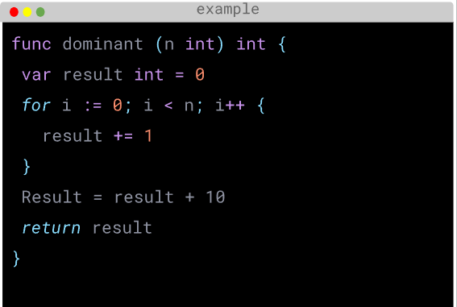
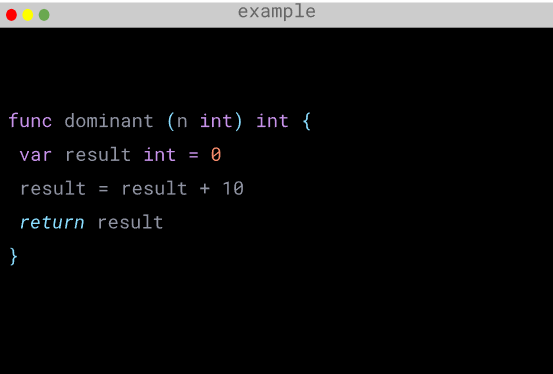
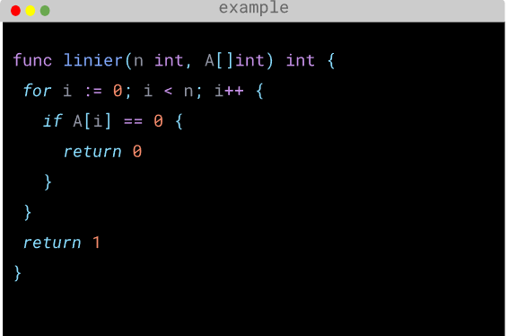
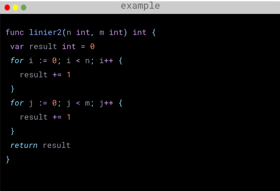
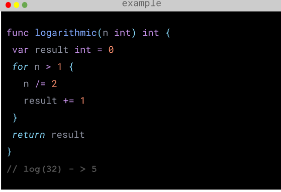
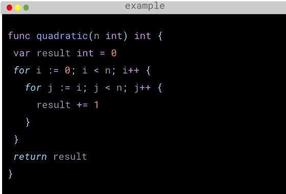

# Time Complexity & Space Complexity :rocket:

## Time Complexity

> Penggunaan kompleksitas waktu membuat kemudahan dalam memprediksi waktu berjalan dari sebuah program. Kompleksitas dapat dilihat sebagai jumlah maksimum operasi primitif yang dapat dilaksanakan suatu program. Operasi yang biasa dilakukan adalah penambahan tunggal, perkalian, pembagian tugas mungkin dalam jumlah terbesar kali. Operasi tersebut disebut sebagai dominan.

## Big-O Notation

> Big O notation adalah cara untuk menggambarkan seberapa efisien waktu komputasi atau ruang yang dibutuhkan oleh algoritma dalam menangani input yang berukuran besar. Ini memberi kita gagasan tentang seberapa cepat algoritma akan berjalan atau seberapa banyak sumber daya yang akan digunakan algoritma tersebut dalam situasi terburuk.

Pada gambar diatas, operasi yang dilakukan pada baris keempat adalah dominanan dan akan dieksekusi sebanyak n kali. Kompleksitas di deskripsikan dengan Big-O Notation: pada kasus ini O(n) - Linear Complexity.

## Constant Time - O(1)

> Constant time, atau O(1), mengacu pada kinerja algoritma yang tetap konstan terlepas dari ukuran inputnya. Artinya, waktu yang dibutuhkan oleh algoritma tersebut tidak berubah seiring dengan pertambahan ukuran input. Ini berarti algoritma tersebut dapat menyelesaikan tugasnya dalam jumlah langkah yang sama, tidak peduli seberapa besar inputnya.

Contoh sederhana dari algoritma dengan waktu konstan adalah akses ke elemen tertentu dalam array dengan indeks tertentu. Misalnya, jika Anda memiliki array dengan 100 elemen, waktu yang dibutuhkan untuk mengakses elemen pada indeks ke-50 akan selalu sama, tidak peduli berapa besar array tersebut. Ini karena akses ke elemen array menggunakan indeks dilakukan dalam waktu konstan. poin kita menyebutnya sebagai Commit.

## Linear Time - O(n)

> Linear time, atau O(n), mengacu pada kinerja algoritma yang memiliki hubungan linier dengan ukuran inputnya. Artinya, waktu yang dibutuhkan oleh algoritma tersebut tumbuh secara proporsional dengan ukuran inputnya. Semakin besar inputnya, semakin lama algoritma akan berjalan.

Contoh algoritma dengan waktu linier adalah pencarian linear di dalam array. Jika Anda mencari nilai tertentu dalam array, Anda perlu memeriksa setiap elemen satu per satu. Jumlah langkah yang dibutuhkan untuk menemukan elemen ini secara linier akan tumbuh seiring dengan jumlah elemen dalam array..

## Linear Time - O(n + m)

> Linear time dengan notasi n + m mengacu pada kinerja algoritma yang memiliki kompleksitas linear terhadap jumlah elemen dalam dua input terpisah, n dan m. Artinya, waktu yang dibutuhkan oleh algoritma tersebut tumbuh secara linier seiring dengan jumlah elemen dalam kedua input tersebut.

Contohnya adalah saat Anda memiliki dua array yang berbeda dengan masing-masing n dan m elemen, dan Anda perlu melakukan operasi pada setiap elemen di kedua array tersebut. Dalam kasus ini, waktu yang dibutuhkan akan sebanding dengan jumlah total elemen dalam kedua array, yaitu n+m.

## Logarithmic Time - O(log n)

> Logarithmic Time, atau O(log n), mengacu pada kinerja algoritma yang waktu eksekusinya tumbuh secara logaritmik seiring dengan ukuran inputnya. Artinya, algoritma semakin lambat dalam menangani input yang semakin besar, tetapi tidak secepat pertumbuhan linier.

Algoritma dengan kompleksitas logaritmik sering kali terjadi dalam algoritma yang membagi masalah menjadi bagian-bagian yang lebih kecil, seperti dalam pencarian biner. Misalnya, dalam pencarian biner di array yang diurutkan algoritma hanya perlu memeriksa setengah elemen pada setiap langkahnya, mengurangi jumlah kemungkinan solusi secara eksponensial.

## Quadratic Time - O(n^2)

> Waktu kuadratik, atau O(n^2), mengacu pada kinerja algoritma yang waktu eksekusinya tumbuh secara kuadratik seiring dengan ukuran inputnya. Artinya, algoritma semakin lambat dalam menangani input yang semakin besar, sebanding dengan kuadrat dari ukuran inputnya.

Contoh umum dari algoritma dengan kompleksitas waktu kuadratik adalah nested loop, di mana setiap elemen dalam input pertama harus diproses dengan setiap elemen dalam input kedua. Jika kedua input memiliki n elemen masing-masing, algoritma tersebut akan melakukan n x n = n^2 operasi, yang membuat kompleksitasnya menjadi O(n^2).

## Exponential dan Factorial Time

> Waktu eksponensial, atau **O(2^n)**, mengacu pada kinerja algoritma di mana waktu eksekusi meningkat secara eksponensial seiring dengan ukuran inputnya. Artinya, algoritma semakin lambat secara signifikan ketika ukuran inputnya bertambah.

Contoh umum dari algoritma dengan kompleksitas waktu eksponensial adalah algoritma brute force yang mencoba setiap kemungkinan solusi untuk masalah kombinatorial. Misalnya, algoritma brute force untuk menyelesaikan masalah Traveling Salesman akan mencoba semua kemungkinan rute, yang berjumlah faktorial dari jumlah kota yang harus dikunjungi.

> Factorial Time, atau **O(n!)**, juga mengacu pada kinerja algoritma di mana waktu eksekusi meningkat secara faktorial seiring dengan ukuran inputnya. Artinya, algoritma semakin lambat secara drastis dengan setiap penambahan elemen input.

Algoritma dengan kompleksitas waktu eksponensial atau faktorial seringkali dihindari karena kinerja yang sangat buruk, terutama untuk input yang sedang hingga besar. Solusi yang lebih efisien biasanya dicari, seperti menggunakan pendekatan dinamis atau heuristik yang lebih cerdas.

## Time Limit

> Time limit adalah batasan waktu yang diberikan untuk mengeksekusi suatu program atau algoritma. Batasan waktu ini umumnya diberikan dalam milidetik atau detik. Saat menjalankan program, jika waktu yang diperlukan untuk menyelesaikan eksekusi melebihi batas waktu yang ditentukan, program tersebut akan dihentikan secara paksa dan biasanya dianggap gagal atau timeout.

Time limit biasanya diterapkan dalam konteks kompetisi pemrograman, pengujian perangkat lunak, atau lingkungan di mana kinerja waktu eksekusi program penting. Tujuannya adalah untuk memastikan bahwa program atau algoritma mampu berjalan secara efisien dan tidak mengalami deadlock atau masalah kinerja lainnya. Time limit juga membantu mencegah program yang tidak efisien atau tidak optimal dari menghabiskan sumber daya yang berlebihan.

## Space Complexity

> Space complexity adalah ukuran ruang yang dibutuhkan oleh suatu algoritma dalam menangani input yang diberikan. Ini mengukur seberapa banyak memori akan digunakan oleh algoritma untuk menyelesaikan tugasnya, tergantung pada ukuran inputnya. Space complexity biasanya diukur dalam jumlah unit memori (biasanya bit atau byte), tetapi juga dapat diukur dalam cara lain tergantung pada konteksnya.

Space complexity sering dinyatakan menggunakan notasi Big O untuk menggambarkan hubungan antara ukuran input dan jumlah memori yang dibutuhkan oleh algoritma dalam situasi terburuk. Misalnya, algoritma dengan space complexity O(1) akan menggunakan jumlah memori yang konstan terlepas dari ukuran inputnya, sedangkan algoritma dengan space complexity O(n) akan menggunakan jumlah memori yang tumbuh secara linear seiring dengan ukuran inputnya.

Penting untuk memperhatikan space complexity ketika merancang atau menganalisis algoritma, karena penggunaan memori yang berlebihan dapat menyebabkan program menjadi lambat atau bahkan gagal jika memori tidak mencukupi.

# Thank You :star2:
