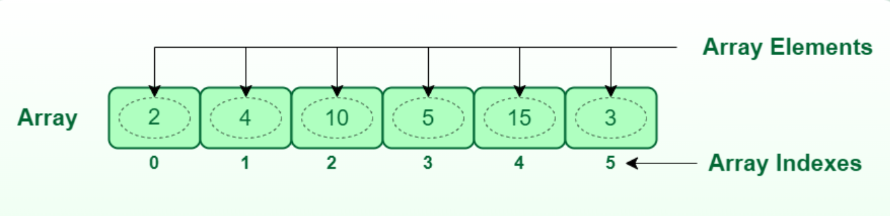
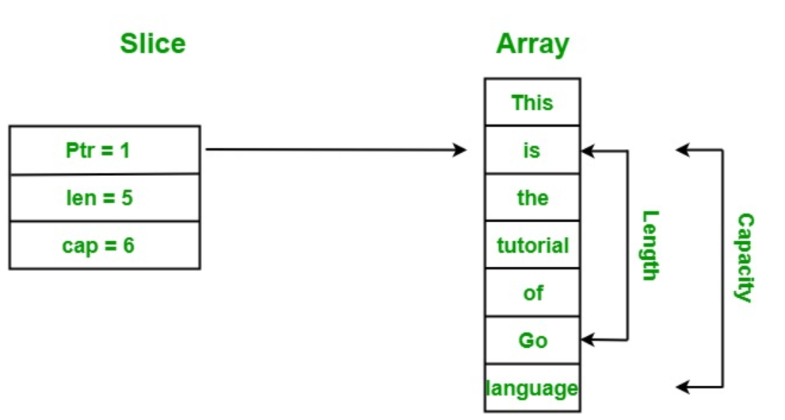
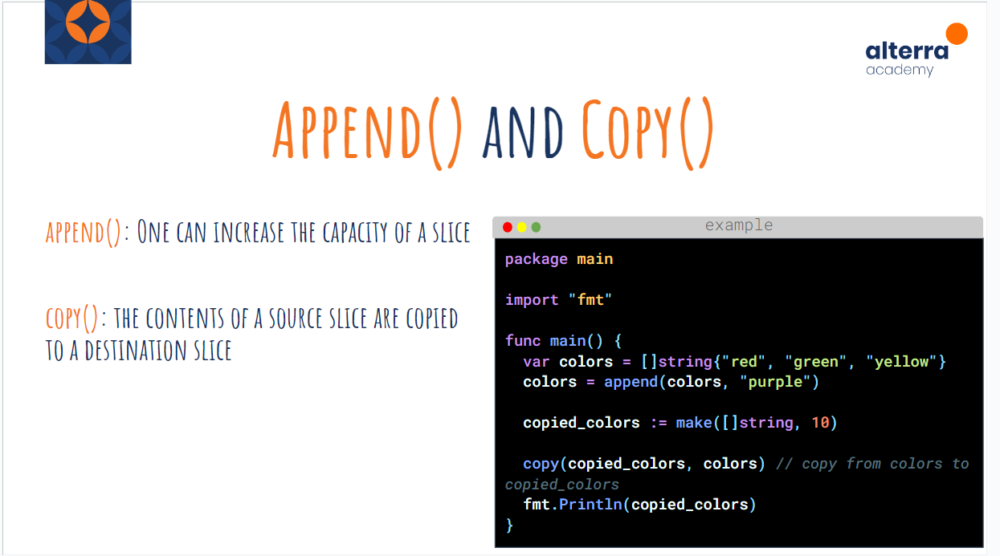
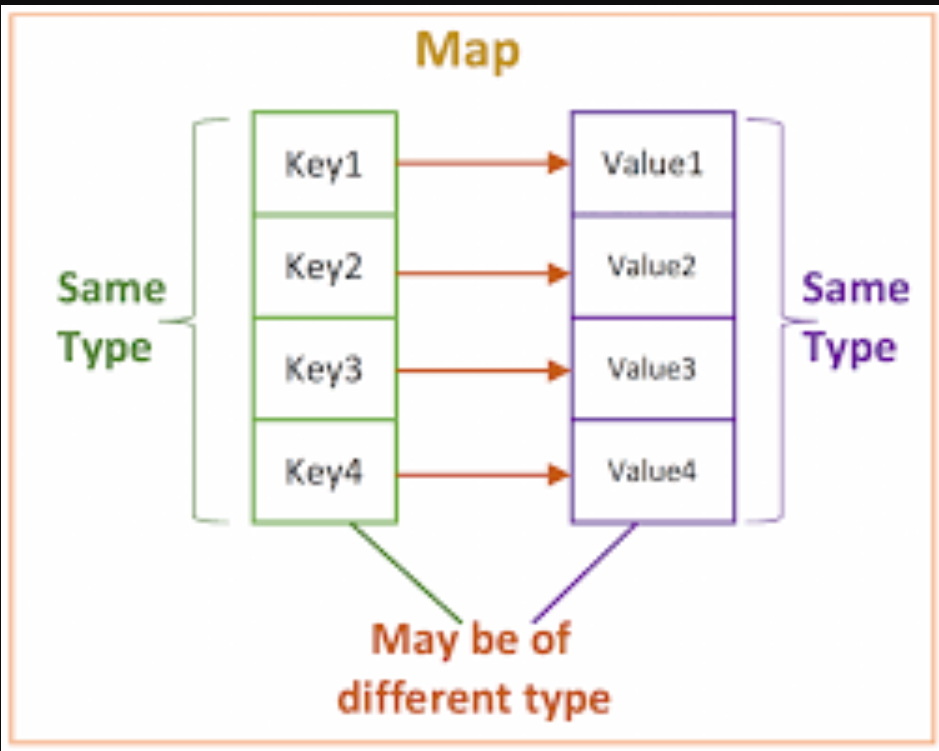

# Data Structure :rocket:

## Array



> Array adalah struktur data yang berisi sekelompok elemen, dapat berisi satu jenis variabel dengan ukuran alokasi yang tetap. Tipe data yang berbeda dapat ditangani sebagai elemen dalam array seperti Numerik, String, Boolean.

### Deklarasi Array

```
var <variable_name> [<size_of_array>]<tipe_variable>

var array [3]int
array[0] = 1
array[1] = 3
array[2] = 5
array2 := [3]int{1,2,3}
fmt.Println(array)
fmt.Println(array2)

```

## Slice



> Slice adalah struktur data yang berisi sekelompok elemen, dapat berisi satu jenis variabel (seperti Array) tetapi memiliki ukuran alokasi yang dinamis.

### Deklarasi Slices

```
var slices []int = []int{1,2,3}
slices = append(slices, 4)
fmt.Println(slices)

```

### Membuat slice dengan Fungsi Make

> make adalah fungsi bawaan dalam Go yang digunakan untuk membuat slice, map, atau channel.
> Fungsi make memiliki beberapa parameter yang dapat Anda atur sesuai kebutuhan:

Tipe Data: Parameter pertama adalah tipe data yang ingin Anda buat (slice, map, atau channel).

Panjang (Untuk Slice dan Channel): Parameter kedua adalah panjang awal dari slice atau channel yang akan dibuat. Untuk map, parameter ini diabaikan karena map tidak memiliki panjang awal yang harus ditentukan.

Kapasitas (Hanya untuk Slice): Untuk slice, parameter ketiga adalah kapasitas awal slice. Kapasitas menunjukkan jumlah elemen yang dapat ditampung oleh slice sebelum alokasi ulang dilakukan secara otomatis oleh Go. Jika tidak diberikan, kapasitas awalnya sama dengan panjang.

```
slice := make([]int, 3, 5)
fmt.Printf("Panjang: %d, Kapasitas: %d\n", len(slice), cap(slice))
```

## Append dan Copy



> append: Fungsi append digunakan untuk menambahkan elemen ke dalam slice. Jika kapasitas slice mencukupi, elemen baru akan ditambahkan langsung ke dalam slice. Namun, jika kapasitas tidak mencukupi, Go akan membuat slice baru dengan kapasitas yang lebih besar, menyalin elemen-elemen yang ada, dan kemudian menambahkan elemen baru. Fungsi append mengembalikan slice baru yang telah diperbarui.

```
slice := []int{1, 2, 3}
slice = append(slice, 4)
```

> copy: Fungsi copy digunakan untuk menyalin elemen dari sebuah slice ke slice lain. Fungsi ini mengembalikan jumlah elemen yang disalin, yang akan sama dengan panjang slice yang lebih pendek dari kedua slice yang dioperasikan.

```
source := []int{1, 2, 3}
destination := make([]int, len(source))
copy(destination, source)
```

## Map



> Map adalah struktur data yang menyimpan data dalam bentuk pasangan kunci dan nilai, di mana setiap kunci bersifat unik.

### Deklarasi Map

```
    m := make(map[string]int)

    m["a"] = 1
    m["b"] = 2

    fmt.Println("Nilai a:", m["a"])

    delete(m, "b")

    val, exists := m["b"]
    fmt.Println("Nilai b:", val, "Kunci ada?", exists)

    for key, value := range m {
        fmt.Println("Kunci:", key, "Nilai:", value)
    }
```

## Package Slice

1. BinarySearch: Mencari nilai dalam slice yang telah diurutkan dengan menggunakan algoritma pencarian biner. Mengembalikan indeks nilai tersebut jika ditemukan, atau -1 jika tidak ditemukan.

2. Clone: Menghasilkan salinan dari slice asli, sehingga perubahan pada salinan tidak mempengaruhi slice asli dan sebaliknya.

3. Compact: Menghapus nilai-nilai nol atau nilai-nilai yang ditentukan lainnya dari slice dan mengembalikan slice baru tanpa nilai-nilai tersebut.

4. Contains: Memeriksa apakah slice mengandung nilai tertentu. Mengembalikan true jika nilai tersebut ditemukan, dan false jika tidak.

5. Delete: Menghapus nilai dari slice berdasarkan indeksnya, kemudian mengembalikan slice baru tanpa nilai tersebut.

6. Equal: Membandingkan dua slice untuk kesamaan. Mengembalikan true jika kedua slice sama, dan false jika tidak.

7. Index: Mencari indeks dari nilai tertentu dalam slice. Mengembalikan indeks nilai tersebut jika ditemukan, atau -1 jika tidak ditemukan.

8. Insert: Menyisipkan nilai ke dalam slice pada indeks tertentu, kemudian mengembalikan slice baru dengan nilai tersebut disisipkan.

9. IsSort: Memeriksa apakah slice telah diurutkan. Mengembalikan true jika sudah diurutkan, dan false jika tidak.

10. MaxMin: Mengembalikan nilai maksimum dan minimum dalam slice.

11. Replace: Mengganti nilai tertentu dalam slice dengan nilai baru, kemudian mengembalikan slice baru dengan nilai yang telah diganti.

12. Reverse: Membalik urutan elemen dalam slice.

13. Sort: Mengurutkan slice.

## Package Map

1. Clone: Menghasilkan salinan dari slice asli, sehingga perubahan pada salinan tidak mempengaruhi slice asli dan sebaliknya.
2. Delete: Menghapus nilai dari slice berdasarkan indeksnya, kemudian mengembalikan slice baru tanpa nilai tersebut.
3. Equal: Membandingkan dua slice untuk kesamaan. Mengembalikan true jika kedua slice sama, dan false jika tidak.

## Function

> Function adalah bagian dari kode yang dipanggil dengan namanya.

Function adalah cara yang mudah untuk membagi kode Anda ke dalam blok-blok yang berguna. Memungkinkan kita menulis kode yang bersih, rapi, dan modular.

### Deklarasi Function

```
func <name_function> () { <statements>}
func main() {}

func <name_function> () <type_return> { <statements> }
func phi() float64 { return 3.14 }

func <name_function> (<parameter>) { <statements> }
func square(value int) int {
   return value * value
}
```

# Thank You :star2:
