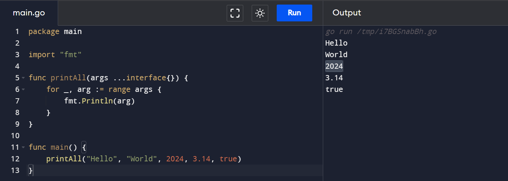
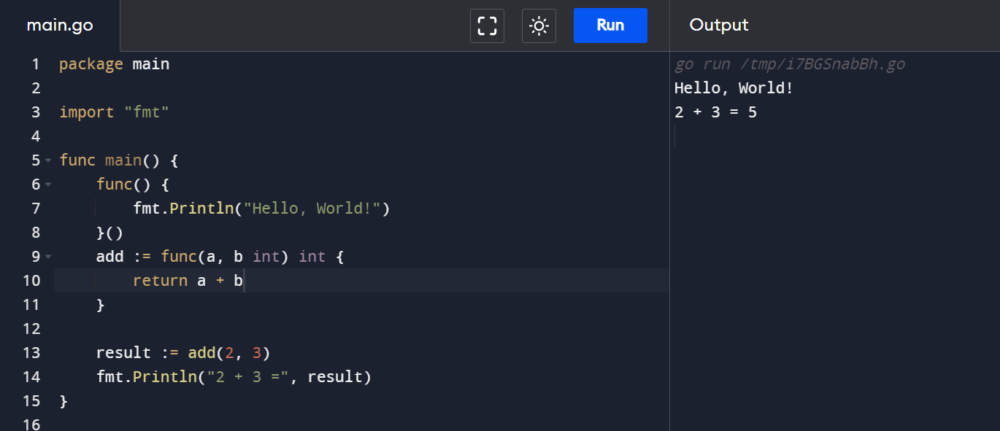
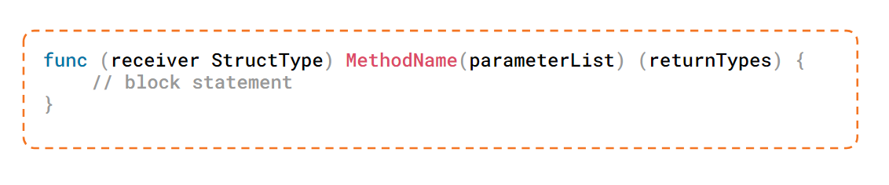

# String, Advance Function , Pointer , Method, Struct and Interface :rocket:

## Bekerja dengan String

### Len

Fungsi len digunakan untuk mengembalikan panjang dari sebuah string.
Contoh :

```
kalimat := "Spiderman"
lenKalimat := len(kalimat)
fmt.Println(lenKalimat) //9
```

### Compare

Fungsi Compare digunakan untuk membandingkan dua string, a dan b.
Contoh :

```
kalimat1 := "Spiderman"
kalimat2 := "batman"
fmt.Println(kalimat1 == kalimat2) //true
```

### Contains

Fungsi Contains digunakan untuk memeriksa apakah sebuah string s mengandung substring substr.
Contoh :

```
kalimat1 := "batman"
kalimat2 := "bat"
check := strings.Contains(kalimat1, kalimat2)
fmt.Println(check) //true
```

### Substring

Digunakan untuk mendapatkan substring dari sebuah string, Anda dapat menggunakan slicing pada string tersebut.
Contoh :

```
str := "Spiderman!"
substr := str[2:6]
fmt.Println(substr) //ider
```

### Replace

Fungsi Replace digunakan untuk mengganti semua kemunculan suatu substring dalam string dengan substring lain.
Contoh :

```
str := "I'm Superman!"
newStr := strings.Replace(str, "Superman", "Batman", -1)
fmt.Println(newStr) // I'm Batman
```

### Insert

Digunakan untuk menambahkan kata kedalam string
Contoh :

```
p := "Hulk"
index := 2
q := p[:index] + "HI" + p[index:]
fmt.Println(p, q) // Hulk HuHIlk

```

## Variadic Function



> Variadic function adalah jenis fungsi dalam bahasa pemrograman Go (dan juga dalam beberapa bahasa pemrograman lain) yang dapat menerima jumlah argumen yang variabel. Dalam definisi fungsi variadic, parameter terakhir dari fungsi tersebut ditandai dengan titik tiga (...) sebelum tipe data parameter. Ini menandakan bahwa parameter tersebut dapat menerima nol atau lebih argumen.

Contoh :

```
package main

import "fmt"

func printAll(args ...interface{}) {
    for _, arg := range args {
        fmt.Println(arg)
    }
}

func main() {
    printAll("Hello", "World", 2024, 3.14, true)
}

```

## Anonymous Function



> Anonymous function, atau sering disebut juga dengan function literal, adalah sebuah fungsi yang tidak diberi nama dan didefinisikan secara langsung di tempat penggunaannya. Anonymous function dapat digunakan di dalam fungsi lain sebagai argumen atau nilai pengembalian, atau dapat disimpan dalam variabel.

Contoh :

```
package main

import "fmt"

func main() {
    func() {
        fmt.Println("Hello, World!")
    }()

    add := func(a, b int) int {
        return a + b
    }

    result := add(2, 3)
    fmt.Println("2 + 3 =", result)
}
```

## Closures

> Closure adalah kombinasi antara sebuah fungsi (biasanya anonymous function) dengan lingkungan (scope) di mana fungsi tersebut didefinisikan. Dalam Golang, closure memungkinkan sebuah fungsi untuk mengakses dan memanipulasi variabel yang berada di luar lingkupnya (outer scope).

Contoh :

```
package main

import "fmt"

func main() {
    adder := func() func(int) int {
        sum := 0
        return func(x int) int {
            sum += x
            return sum
        }
    }

    adderInstance := adder()

    fmt.Println(adderInstance(1)) // Output: 1
    fmt.Println(adderInstance(2)) // Output: 3
    fmt.Println(adderInstance(3)) // Output: 6
}

```

## Defer Function

> Di Go, defer digunakan untuk menjadwalkan eksekusi suatu fungsi agar dieksekusi setelah fungsi yang mengandung defer selesai dieksekusi, tetapi sebelum fungsi tersebut mengembalikan nilai ke pemanggilnya. Ini sering digunakan untuk membersihkan sumber daya seperti menutup file, mengunci mutex, atau mengembalikan status yang diubah.

```
package main

import "fmt"

func main() {
    defer fmt.Println("world")

    fmt.Println("hello")
}

```

> Output :
> hello
> world

## Pointer

> Pointer adalah variabel yang berisi alamat memori dari nilai variabel lain di dalam program. Dalam Go, Anda dapat menggunakan pointer untuk mengakses dan memanipulasi nilai variabel tersebut. Pointer digunakan untuk menghindari penggunaan nilai yang besar untuk dipindahkan ke dalam fungsi, karena hanya alamat memori yang dipindahkan.

Dalam Go, untuk mendapatkan alamat memori dari sebuah variabel, Anda menggunakan operator **&**, dan untuk mendapatkan nilai dari alamat memori yang disimpan dalam pointer, Anda menggunakan operator \*.

```
package main

import "fmt"

func main() {
    var a int = 42
    var pointerToA *int = &a

    fmt.Println("Nilai dari a:", a)
    fmt.Println("Alamat memori dari a:", &a)
    fmt.Println("Nilai dari pointerToA:", *pointerToA)

    *pointerToA = 21
    fmt.Println("Nilai dari a setelah diubah melalui pointerToA:", a)
}

```

> Output:
> Nilai dari a: 42
> Alamat memori dari a: 0xc000122000
> Nilai dari pointerToA: 42
> Nilai dari a setelah diubah melalui pointerToA: 21

## Struct

> Struct adalah kumpulan dari satu atau lebih variabel yang disusun dalam satu kesatuan. Struct memungkinkan Anda untuk membuat tipe data baru yang memiliki properti-properti (atau biasa disebut fields) dengan tipe data yang berbeda-beda. Di Go, struktur data struct mirip dengan konsep struct dalam bahasa pemrograman lainnya.

Contoh penggunaan struct di Go:

```
package main

import "fmt"

type Person struct {
    Name string
    Age  int
}

func main() {
    var person1 Person
    person1.Name = "Alice"
    person1.Age = 30

    person2 := Person{Name: "Bob", Age: 25}

    fmt.Println("Person 1 - Name:", person1.Name, ", Age:", person1.Age)
    fmt.Println("Person 2 - Name:", person2.Name, ", Age:", person2.Age)
}

```

### Method pada struct

> Method struct adalah fungsi yang terasosiasi dengan sebuah struct dalam bahasa pemrograman Go. Method struct memungkinkan Anda untuk menambahkan perilaku khusus atau operasi-operasi tertentu yang terkait dengan sebuah struct. Method ini bekerja pada instance dari struct tersebut, mirip dengan method pada objek dalam pemrograman berorientasi objek.

Dalam Go, Anda dapat mendefinisikan method struct dengan menambahkan fungsi ke struct tersebut, dengan menyertakan receiver di depan tipe data parameter. Receiver adalah variabel yang menjadi target dari method tersebut.

Contoh penggunaan dalam golang :


```
package main

import "fmt"

type Rectangle struct {
    Width  float64
    Height float64
}

func (r Rectangle) Area() float64 {
    return r.Width * r.Height
}

func main() {
    rect := Rectangle{Width: 10, Height: 5}

    area := rect.Area()
    fmt.Println("Luas Rectangle:", area)
}

```

Pada contoh di atas, kita mendefinisikan struct Rectangle dengan dua fields, Width dan Height. Kemudian, kita mendefinisikan method Area yang memiliki receiver r dengan tipe Rectangle. Method Area mengembalikan hasil perkalian antara Width dan Height dari Rectangle yang menjadi receiver.

## Interface

> Interface adalah kumpulan dari definisi method-method yang harus diimplementasikan oleh suatu tipe data (struct) untuk menjadi tipe data tersebut. Dalam Go, sebuah tipe data dianggap mengimplementasikan sebuah interface jika tipe data tersebut memiliki semua method yang didefinisikan oleh interface tersebut, meskipun tipe data tersebut tidak secara eksplisit menyatakan bahwa ia mengimplementasikan interface tersebut.

Interface digunakan untuk membuat kode lebih fleksibel dan reusable, karena dengan menggunakan interface, kita dapat menulis fungsi atau struktur data yang dapat beroperasi dengan berbagai tipe data yang mengimplementasikan interface yang sama, tanpa harus bergantung pada tipe data spesifik.

Contoh Penggunaan dalam golang :

```
package main

import "fmt"

type Shape interface {
    Area() float64
}

type Rectangle struct {
    Width  float64
    Height float64
}

func (r Rectangle) Area() float64 {
    return r.Width * r.Height
}

type Circle struct {
    Radius float64
}

func (c Circle) Area() float64 {
    return 3.14 * c.Radius * c.Radius
}

func printArea(s Shape) {
    fmt.Println("Luas:", s.Area())
}

func main() {
    rect := Rectangle{Width: 10, Height: 5}
    circle := Circle{Radius: 7}

    printArea(rect)   // Output: Luas: 50
    printArea(circle) // Output: Luas: 153.86
}

```

Pada contoh di atas, kita mendefinisikan sebuah interface Shape yang memiliki method Area() float64. Kemudian, kita mendefinisikan dua struct Rectangle dan Circle, masing-masing dengan method Area() yang mengimplementasikan interface Shape.

Kemudian, kita mendefinisikan fungsi printArea yang menerima parameter bertipe Shape. Karena kedua struct Rectangle dan Circle mengimplementasikan interface Shape dengan memiliki method Area(), kita dapat menggunakan fungsi printArea untuk mencetak luas dari kedua bentuk tersebut tanpa perlu mengetahui tipe data spesifiknya. Ini menunjukkan fleksibilitas dan reusable code yang dihasilkan oleh penggunaan interface.

# Thank You :star2:
