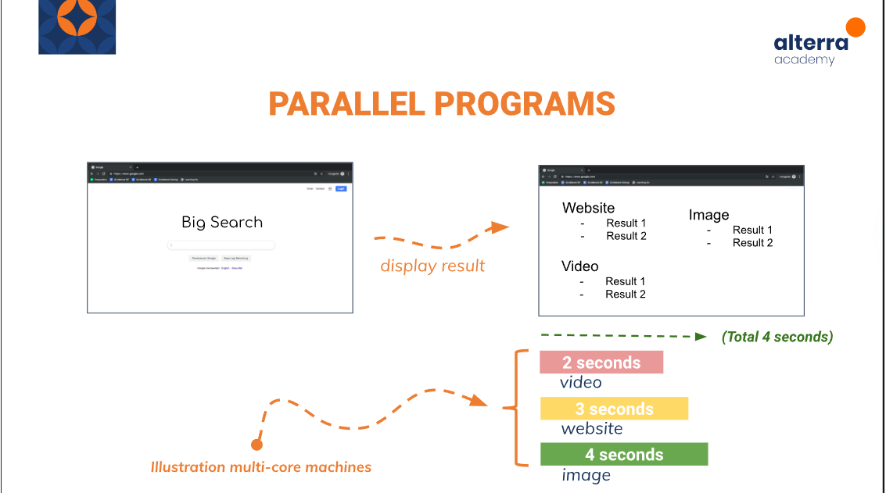

# Concurrent Programming :rocket:

> Concurrent Programming teknik pemrograman yang memungkinkan beberapa tugas berjalan secara bersamaan. Di Go, concurrency dicapai melalui goroutines dan channels. Goroutines adalah thread ringan yang dikelola oleh runtime Go, dan channels digunakan untuk komunikasi dan sinkronisasi antara goroutines.

## Sequential, Parallel, Concurrent, dan Concurrent + Parallel



- Sequential: Tugas dieksekusi satu per satu secara berurutan.
  
- Parallel: Tugas dieksekusi secara bersamaan menggunakan beberapa prosesor atau core.
  
- Concurrent: Tugas dieksekusi secara independen dan mungkin tumpang tindih dalam waktu, tetapi tidak selalu secara bersamaan.
  
- Concurrent + Parallel: Tugas dieksekusi secara independen dan mungkin tumpang tindih dalam waktu, memanfaatkan beberapa prosesor atau core untuk eksekusi simultan.

## Goroutines

> Goroutines adalah fungsi yang berjalan secara bersamaan dengan fungsi lain. Mereka dibuat menggunakan kata kunci go diikuti dengan pemanggilan fungsi. Berikut contoh sederhana penggunaan goroutines:

```
package main

import (
    "fmt"
    "time"
)

func sayHello() {
    fmt.Println("Hello, Goroutine!")
}

func main() {
    go sayHello()
    time.Sleep(1 * time.Second) // Tunggu goroutine selesai
}
```

## Go Maxprocs


> GOMAXPROCS adalah variabel lingkungan di Go yang menentukan jumlah maksimum CPU yang dapat menjalankan secara bersamaan. Secara default, Go mengatur GOMAXPROCS sesuai dengan jumlah core CPU yang tersedia di mesin. Anda dapat mengatur GOMAXPROCS secara manual menggunakan paket runtime:

## Channel dan Select

> Channel digunakan untuk komunikasi dan sinkronisasi antara goroutines. Mereka memungkinkan goroutines untuk mengirim dan menerima nilai. Select digunakan untuk menunggu operasi channel secara simultan. Berikut contoh penggunaan channel dan select:

```
package main

import (
    "fmt"
    "time"
)

func sendNumbers(ch chan int) {
    for i := 0; i < 5; i++ {
        ch <- i
        time.Sleep(500 * time.Millisecond)
    }
    close(ch)
}

func main() {
    ch := make(chan int)
    go sendNumbers(ch)

    for {
        select {
        case num, ok := <-ch:
            if !ok {
                fmt.Println("Channel ditutup")
                return
            }
            fmt.Println("Diterima:", num)
        }
    }
}
```

### Buffered Channel dan Unbuffered Channel


- Unbuffered Channels: Membutuhkan kedua goroutines untuk siap mengirim dan menerima data pada saat yang sama. Contoh:

```
ch := make(chan int)
```

Buffered Channels: Memungkinkan sejumlah nilai disimpan dalam channel tanpa penerima yang sesuai. Contoh:

```
ch := make(chan int, 3) // Buffer size 3

```

## Race Condition

> Race condition terjadi ketika dua atau lebih goroutines mengakses data bersamaan, dan setidaknya satu dari akses tersebut adalah operasi tulis. Hal ini dapat menyebabkan perilaku yang tidak terduga. Contoh:

```
package main

import "fmt"


func getNumber() int {
  var i int

  go func(){
    i = 5
  }()

    return i
}
func main() {
   fmt.Println(getNumber())
}
```

## Memperbaiki Race Condition dengan WaitGroup, Channel Blocking, dan Mutex

> Race condition terjadi ketika dua atau lebih goroutine mengakses dan memodifikasi data bersamaan tanpa sinkronisasi yang tepat. Ini dapat mengakibatkan hasil yang tidak konsisten atau bahkan crash program. Untuk mengatasi race condition, kita dapat menggunakan teknik sinkronisasi seperti WaitGroup, Channel Blocking, dan Mutex.

### Waitgroup

> WaitGroup digunakan untuk menunggu sekelompok goroutine selesai sebelum melanjutkan eksekusi program. Ini membantu menghindari race condition dengan memastikan bahwa semua goroutine selesai sebelum langkah berikutnya dieksekusi.WaitGroup memiliki tiga method utama:

**Add**: Digunakan untuk menambahkan jumlah goroutine yang sedang berjalan. Setiap kali Anda memulai goroutine baru, panggil Add(1) untuk menambahkan jumlah goroutine yang sedang berjalan.
**Done**: Digunakan untuk mengurangi jumlah goroutine yang sedang berjalan. Setiap goroutine selesai, panggil Done() untuk mengurangi jumlah goroutine yang sedang berjalan.
**Wait**: Digunakan untuk menunggu hingga jumlah goroutine yang sedang berjalan menjadi nol. Panggil Wait() di akhir program atau di tempat lain yang sesuai untuk menunggu semua goroutine selesai.

```
var wg sync.WaitGroup
wg.Add(1)
go func() {
    defer wg.Done()
    // Kode Anda di sini
}()
wg.Wait()
```

### Channel Blocking

> Channel blocking terjadi saat sebuah goroutine mencoba untuk mengirim atau menerima data dari channel, tetapi tidak ada goroutine lain yang siap untuk melakukan operasi tersebut. Hal ini menyebabkan goroutine tersebut terblokir (blocked) hingga ada goroutine lain yang siap untuk melakukan operasi di channel tersebut.

```
package main

import (
    "fmt"
    "time"
)

func main() {
    ch := make(chan bool) // Channel tanpa buffer

    go func() {
        // Proses yang membutuhkan waktu
        time.Sleep(2 * time.Second)
        ch <- true // Mengirim data ke channel setelah selesai
    }()

    // Blocking, menunggu data dari channel
    fmt.Println("Menunggu data dari channel...")
    <-ch // Menerima data dari channel
    fmt.Println("Data diterima dari channel")
}
```

Pada contoh di atas, goroutine pertama mengirim data ke channel setelah 2 detik. Di sisi lain, main goroutine terblokir pada operasi <-ch hingga data diterima dari channel. Ini adalah contoh sederhana dari channel blocking.

### Mutex

> Mutex adalah singkatan dari Mutual Exclusion, yang merupakan mekanisme untuk mengunci akses ke data bersama sehingga hanya satu goroutine yang dapat mengakses data tersebut pada satu waktu. Di Go, Mutex didefinisikan dalam paket sync dan memiliki dua method utama:

**Lock**: Digunakan untuk mengunci mutex sebelum mengakses data bersama. Ini memastikan bahwa hanya satu goroutine yang dapat mengakses data pada satu waktu.
**Unlock**: Digunakan untuk membuka kunci mutex setelah selesai mengakses data bersama. Ini memungkinkan goroutine lain untuk mengakses data setelah selesai.

```
package main

import (
    "fmt"
    "sync"
)

var (
    counter = 0
    mu      sync.Mutex
)

func incrementCounter(wg *sync.WaitGroup) {
    defer wg.Done()
    mu.Lock() // Mengunci akses ke counter
    counter++
    mu.Unlock() // Membuka kunci
}

func main() {
    var wg sync.WaitGroup
    for i := 0; i < 1000; i++ {
        wg.Add(1)
        go incrementCounter(&wg)
    }
    wg.Wait()
    fmt.Println("Counter:", counter)
}
```

Penggunaan Mutex secara tepat dapat membantu mencegah race condition dan memastikan bahwa akses ke data bersama diatur dengan benar. Namun, perlu diingat bahwa penggunaan Mutex harus hati-hati, karena penggunaan yang tidak tepat dapat mengakibatkan deadlock

# Thank You :star2:
